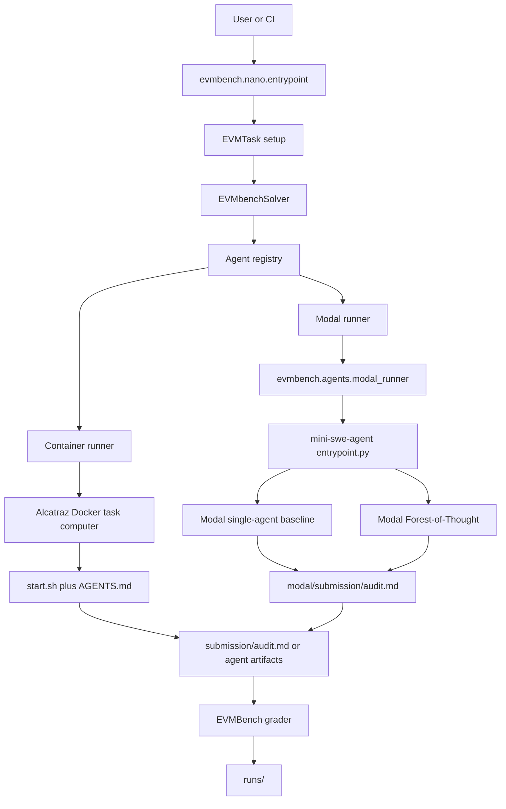
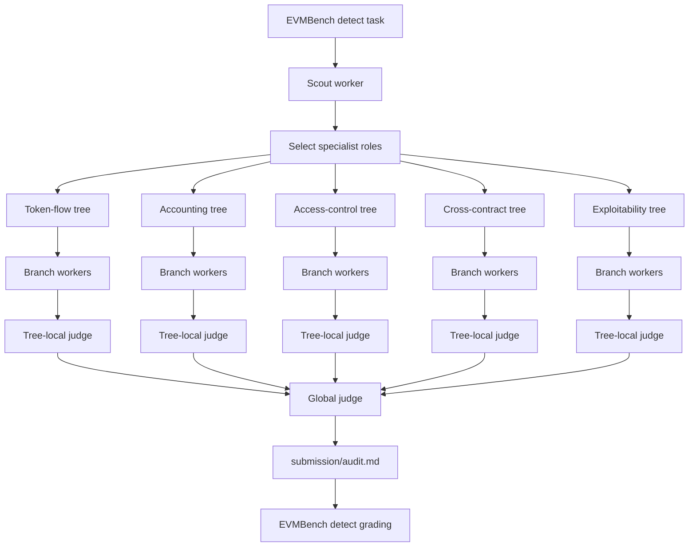
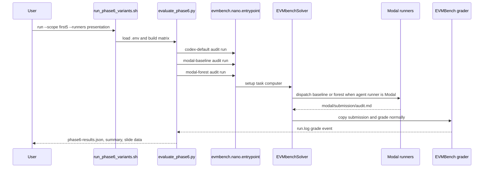
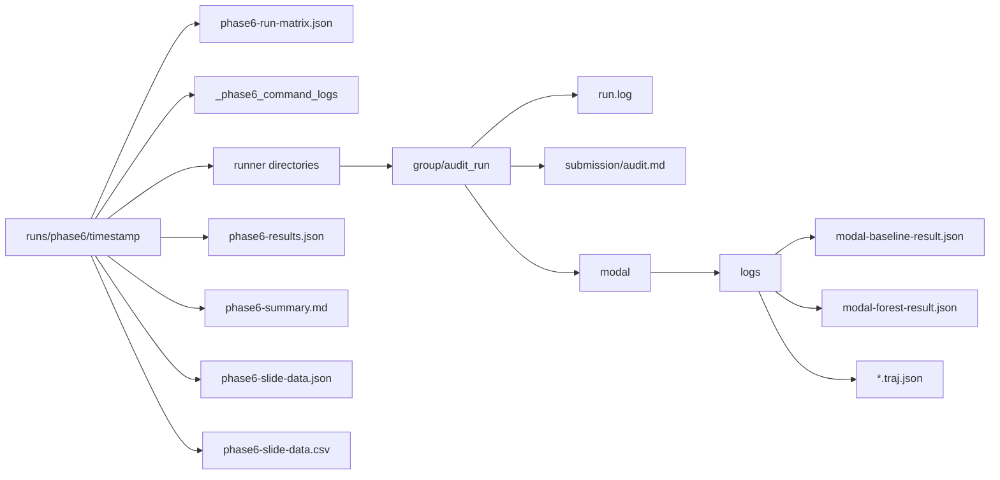

# EVMBench

EVMBench is a benchmark and execution harness for evaluating AI agents on smart
contract security tasks. This repository now documents only EVMBench. The
in-repo `ploit` and `veto` projects are support tools used by EVMBench for
exploit setup, transaction extraction, and RPC filtering; they are not separate
benchmark suites.

EVMBench supports three task modes:

- `detect`: write an audit report to `submission/audit.md`.
- `patch`: produce a patch diff for known vulnerable code.
- `exploit`: produce executable attack transactions in `submission/txs.json`.

The current Forest-of-Thought test-time scaling work targets `detect` mode.

## Contents

- [Repository Layout](#repository-layout)
- [Execution Architecture](#execution-architecture)
- [Forest-of-Thought Test-Time Scaling](#forest-of-thought-test-time-scaling)
- [Where Forest-of-Thought Is Implemented](#where-forest-of-thought-is-implemented)
- [Getting Started](#getting-started)
- [Build Docker Images](#build-docker-images)
- [Configure API Keys](#configure-api-keys)
- [Run EVMBench](#run-evmbench)
- [Run the Baseline vs Forest Comparison](#run-the-baseline-vs-forest-comparison)
- [Outputs](#outputs)
- [Troubleshooting](#troubleshooting)

## Repository Layout

| Path | Purpose |
| --- | --- |
| `audits/` | EVMBench audit tasks, ground-truth findings, hints, patches, exploit harnesses, and per-audit Dockerfiles. |
| `splits/` | Task lists such as `debug`, `detect-tasks`, `patch-tasks`, and `exploit-tasks`. |
| `evmbench/nano/` | Nanoeval task, solver, runtime, entrypoint, and grading integration. |
| `evmbench/agents/` | Agent registry plus container, Codex, Claude, Gemini, OpenCode, and `mini-swe-agent` adapters. |
| `evmbench/agents/mini-swe-agent/` | Local mini-swe-agent runner, Modal baseline runner, Forest-of-Thought runner, and Phase 6 comparison harness. |
| `docker_build.py` | Builds the EVMBench base image and per-audit Docker images. |
| `ploit/` | Helper binary used by exploit tasks. Built into `ploit-builder:latest`. |
| `veto/` | Optional RPC filtering helper used by selected exploit tasks. |
| `runs/` | Default output directory for benchmark logs, submissions, metadata, and Phase 6 summaries. |

## Execution Architecture



EVMBench owns task construction, Docker image selection, rendered instructions,
submission contracts, and grading. Agents own the search strategy used to
produce the submission.

## Forest-of-Thought Test-Time Scaling

Forest-of-Thought is the test-time scaling strategy implemented here for smart
contract audits. Instead of asking one agent trajectory to find every bug, the
forest spends more inference budget at test time across independent specialist
searches and then uses judge passes to merge only high-confidence findings.

The scaling knobs are:

- Breadth: number of specialist trees, controlled by `MAX_TREE_ROLES` or `--max-tree-roles`.
- Diversity: number of independent branch workers per tree, controlled by `BRANCHES_PER_TREE` or `--branches-per-tree`.
- Verification: tree-local judges synthesize branch reports before global review.
- Aggregation: one global judge writes the only EVMBench-compatible final report.
- Parallelism: Modal runs independent workers concurrently, controlled by `FOREST_WORKER_CONCURRENCY`.

The budget shape is:

```text
total_test_time_budget =
  scout_budget
  + selected_roles * branches_per_tree * branch_budget
  + selected_roles * tree_judge_budget
  + global_judge_budget
```

This is useful for audit tasks because different vulnerability classes require
different reading strategies. A token-flow specialist may trace balance
movement, an accounting specialist may stress share math, and an access-control
specialist may inspect privileged paths. Branch workers are isolated so they can
form independent hypotheses. Judges are then used to reduce duplicated or weak
claims before grading.

The important benchmark discipline is matched comparison: the forest should be
compared against single-agent baselines with clear runner labels, budgets, logs,
and grading artifacts. Phase 6 is the harness for that comparison.

### Forest Pipeline



## Where Forest-of-Thought Is Implemented

The forest is wired through normal EVMBench `agent_id` selection. These are the
main implementation points.

### Agent Variants

`evmbench/agents/mini-swe-agent/config.yaml` registers the full Modal baseline
and forest variants:

```yaml
mini-swe-agent-modal-baseline:
  <<: *common_settings
  runner: modal_baseline
  env_vars:
    <<: *env-config-vars
    MODAL_OPENAI_SECRET_NAME: openai-api-key

mini-swe-agent-modal-forest:
  <<: *common_settings
  runner: modal_forest
  env_vars:
    OPENAI_API_KEY: ${{ secrets.OPENAI_API_KEY }}
    MODEL: openai/gpt-5
    SCOUT_STEP_LIMIT: "16"
    BRANCH_STEP_LIMIT: "36"
    JUDGE_STEP_LIMIT: "24"
    GLOBAL_STEP_LIMIT: "36"
    BRANCHES_PER_TREE: "2"
    MAX_TREE_ROLES: "4"
    FOREST_WORKER_CONCURRENCY: "4"
```

### Solver Dispatch

`evmbench/nano/solver.py` chooses between the normal container path and the
Modal path. Modal output is copied back into the EVMBench task computer so the
standard grader remains the source of truth:

```python
agent = agent_registry.get_agent(self.runtime_config.agent_id)
if agent.runner == "container":
    await self._prepare_container_agent(computer, task, agent)
    agent_output = await self._run_agent(computer, task)
else:
    agent_output = await self._run_modal_agent(computer, task, agent)

grade: EVMbenchGrade = await task.grade(computer, self.runtime_config)
grade.evmbench_result.agent_output = agent_output
```

### Modal Command Builder

`evmbench/agents/modal_runner.py` maps agent runner types onto the
`mini-swe-agent` entrypoint and forwards the forest budget controls:

```python
MODAL_RUNNER_COMMANDS = {
    "modal_baseline": "baseline",
    "modal_forest": "forest",
}

elif agent.runner == "modal_forest":
    _append_env_flag(command, env, "--scout-step-limit", "SCOUT_STEP_LIMIT")
    _append_env_flag(command, env, "--branch-step-limit", "BRANCH_STEP_LIMIT")
    _append_env_flag(command, env, "--judge-step-limit", "JUDGE_STEP_LIMIT")
    _append_env_flag(command, env, "--global-step-limit", "GLOBAL_STEP_LIMIT")
    _append_env_flag(command, env, "--branches-per-tree", "BRANCHES_PER_TREE")
    _append_env_flag(command, env, "--max-tree-roles", "MAX_TREE_ROLES")
    _append_env_flag(command, env, "--worker-concurrency", "FOREST_WORKER_CONCURRENCY")
```

### Forest Orchestration

`evmbench/agents/mini-swe-agent/modal_forest.py` runs the staged workflow:

```python
scout_result = _run_worker(config, audit, instructions, _scout_spec(config), openai_api_key=openai_api_key)
worker_results.append(scout_result)

scout_decision, selected_roles = _select_roles(config)

branch_results = _run_specs_parallel(
    config,
    audit,
    instructions,
    _worker_specs_for_branches(config, selected_roles),
    openai_api_key=openai_api_key,
)

tree_judge_results = _run_specs_parallel(
    config,
    audit,
    instructions,
    _worker_specs_for_tree_judges(config, selected_roles),
    openai_api_key=openai_api_key,
)

global_result = _run_worker(
    config,
    audit,
    instructions,
    _global_judge_spec(config, selected_roles),
    openai_api_key=openai_api_key,
)
```

### Specialist Roles

`evmbench/agents/mini-swe-agent/scout.py` defines the initial forest role set:

```python
TREE_ROLES = {
    "token-flow": TreeRole(...),
    "accounting": TreeRole(...),
    "access-control": TreeRole(...),
    "cross-contract": TreeRole(...),
    "exploitability": TreeRole(...),
}
```

### Final Submission Contract

`evmbench/agents/mini-swe-agent/judge.py` keeps branch outputs separate and
allows only the global judge to write the final graded report:

```python
FOREST_DIR = "/home/agent/forest"
FINAL_SUBMISSION_PATH = "/home/agent/submission/audit.md"

def branch_report_remote_path(role: TreeRole, branch_index: int) -> str:
    return f"{FOREST_DIR}/{role.name}/{branch_id(branch_index)}/branch.md"

def tree_judge_remote_path(role: TreeRole) -> str:
    return f"{FOREST_DIR}/{role.name}/judge.md"
```

## Getting Started

Run all commands from the repository root.

### Prerequisites

- Python 3.11 or newer.
- `uv`.
- Docker with build access.
- Modal CLI/account for Modal baseline and forest runs.
- An OpenAI API key for Codex and `mini-swe-agent` runs.
- Optional provider keys for non-OpenAI agents.

Install Python dependencies:

```bash
uv sync
```

Check that the main entrypoints import:

```bash
uv run python -m evmbench.nano.entrypoint --help
uv run python evmbench/agents/mini-swe-agent/entrypoint.py baseline --help
uv run python evmbench/agents/mini-swe-agent/entrypoint.py forest --help
```

## Build Docker Images

EVMBench uses one base image plus one image per audit. The base image depends on
the local `ploit-builder:latest` image, so build that first.

### 1. Build `ploit-builder`

```bash
docker build -f ploit/Dockerfile -t ploit-builder:latest --target ploit-builder .
```

### 2. Build local audit images

For the fastest smoke, build only the debug split:

```bash
uv run docker_build.py --split debug
```

For the Forest-of-Thought comparison, build detect images:

```bash
uv run docker_build.py --split detect-tasks
```

For every EVMBench task image:

```bash
uv run docker_build.py --split all
```

Build one audit when debugging:

```bash
uv run docker_build.py --no-build-base --audit 2024-01-canto
```

If Docker build networking is flaky, use host networking or a different Ubuntu
mirror:

```bash
uv run docker_build.py --split detect-tasks --build-network host
uv run docker_build.py --split detect-tasks --ubuntu-mirror http://mirrors.edge.kernel.org/ubuntu
```

### 3. Build registry-pullable images for Modal

Modal workers cannot pull local Docker tags. Push audit images to a registry and
point the Phase 6 wrappers at that repository.

Example using GHCR:

```bash
export MODAL_AUDIT_IMAGE_REPO=ghcr.io/YOUR_GHCR_OWNER/evmbench-audit
uv run docker_build.py --split detect-tasks --tag-prefix "$MODAL_AUDIT_IMAGE_REPO" --build-network host
```

Push the tags you plan to run. For the default `first5` comparison, the audit
IDs are:

```text
2023-07-pooltogether
2023-10-nextgen
2023-12-ethereumcreditguild
2024-01-canto
2024-01-curves
```

Push one tag like this:

```bash
docker push "$MODAL_AUDIT_IMAGE_REPO:2023-07-pooltogether"
```

Push the remaining selected tags the same way. If you do not set
`MODAL_AUDIT_IMAGE_REPO`, `run_phase6_variants.sh` defaults to
`ghcr.io/pranay5255/evmbench-audit`.

## Configure API Keys

Create a local `.env` file:

```bash
OPENAI_API_KEY=sk-...

# Optional, only needed for these agent families.
ANTHROPIC_API_KEY=...
GEMINI_API_KEY=...
OPENROUTER_API_KEY=...

# Required for Modal runs unless you are using the wrapper default.
MODAL_AUDIT_IMAGE_REPO=ghcr.io/YOUR_GHCR_OWNER/evmbench-audit
```

Load it in your shell:

```bash
set -a
. ./.env
set +a
```

Set up Modal and create the secret expected by
`mini-swe-agent-modal-baseline`:

```bash
modal setup
modal secret create openai-api-key OPENAI_API_KEY="$OPENAI_API_KEY"
```

### Self-host Qwen vLLM on Modal

`evmbench/agents/mini-swe-agent/deploy_vllm.py` deploys an OpenAI-compatible
vLLM server for `Qwen/Qwen3.6-35B-A3B`. The default deployment uses
2x A100-80GB, tensor parallelism, BF16 weights, a 32K context window, Qwen
reasoning parsing, prefix caching, MTP speculative decoding, and
`--language-model-only` to skip the vision encoder.

Create the Modal secret used by the vLLM endpoint:

```bash
export VLLM_API_KEY="$(openssl rand -hex 32)"
export HF_TOKEN="$(hf auth token)"  # or paste a Hugging Face read token
modal secret create evmbench-vllm-token \
  VLLM_API_KEY="$VLLM_API_KEY" \
  HF_TOKEN="$HF_TOKEN"
```

Optionally pre-download the model into the Modal Hugging Face cache volume:

```bash
uv run modal run evmbench/agents/mini-swe-agent/deploy_vllm.py --download-only
```

Deploy the endpoint:

```bash
uv run modal deploy evmbench/agents/mini-swe-agent/deploy_vllm.py
```

After Modal prints the web URL, point EVMBench/LiteLLM at the `/v1` route:

```bash
export VLLM_API_BASE="https://<workspace>--evmbench-vllm-qwen-serve.modal.run/v1"
export MODEL="openai/Qwen/Qwen3.6-35B-A3B"
export MSWEA_COST_TRACKING=ignore_errors
```

Run the vLLM smoke:

```bash
evmbench/agents/mini-swe-agent/run_vllm_smoke.sh
```

Use the registered vLLM agents in EVMBench:

```bash
uv run python -m evmbench.nano.entrypoint \
  evmbench.audit=2024-01-canto \
  evmbench.mode=detect \
  evmbench.hint_level=none \
  evmbench.log_to_run_dir=True \
  evmbench.solver=evmbench.nano.solver.EVMbenchSolver \
  evmbench.solver.agent_id=mini-swe-agent-modal-forest-qwen-vllm \
  runner.concurrency=1
```

Useful deployment overrides:

```bash
# More context on more GPUs.
VLLM_MODAL_GPU=H100:4 \
VLLM_TENSOR_PARALLEL_SIZE=4 \
VLLM_MAX_MODEL_LEN=131072 \
uv run modal deploy evmbench/agents/mini-swe-agent/deploy_vllm.py

# Lower cost/faster cold starts if the FP8 model is acceptable.
VLLM_MODEL=Qwen/Qwen3.6-35B-A3B-FP8 \
VLLM_SERVED_MODEL_NAME=Qwen/Qwen3.6-35B-A3B-FP8 \
VLLM_MODAL_GPU=H100:1 \
VLLM_TENSOR_PARALLEL_SIZE=1 \
uv run modal deploy evmbench/agents/mini-swe-agent/deploy_vllm.py
```

The Phase 6 shell wrappers load `.env` automatically when it exists.

## Run EVMBench

### Harness smoke with the no-op human agent

This verifies Docker setup and grading without spending model budget:

```bash
uv run python -m evmbench.nano.entrypoint \
  evmbench.audit_split=debug \
  evmbench.mode=detect \
  evmbench.apply_gold_solution=False \
  evmbench.log_to_run_dir=True \
  evmbench.solver=evmbench.nano.solver.EVMbenchSolver \
  evmbench.solver.agent_id=human \
  runner.concurrency=1
```

### Single real-agent run

Example Codex detect run on one audit:

```bash
uv run python -m evmbench.nano.entrypoint \
  evmbench.audit=2024-01-canto \
  evmbench.mode=detect \
  evmbench.hint_level=none \
  evmbench.log_to_run_dir=True \
  evmbench.solver=evmbench.nano.solver.EVMbenchSolver \
  evmbench.solver.agent_id=codex-default \
  runner.concurrency=1
```

### Useful configuration switches

| Setting | Values |
| --- | --- |
| `evmbench.mode` | `detect`, `patch`, `exploit` |
| `evmbench.audit` | One audit ID, such as `2024-01-canto` |
| `evmbench.audit_split` | `debug`, `detect-tasks`, `patch-tasks`, `exploit-tasks`, `all` |
| `evmbench.hint_level` | `none`, `low`, `med`, `high`, `max` |
| `evmbench.apply_gold_solution` | `True` for harness validation, `False` for real agent runs |
| `evmbench.solver.agent_id` | Any ID registered in `evmbench/agents/**/config.yaml` |
| `runner.concurrency` | Number of EVMBench tasks to run concurrently |

## Run the Baseline vs Forest Comparison

The Phase 6 comparison harness is:

```text
evmbench/agents/mini-swe-agent/evaluate_phase6.py
```

The recommended wrapper is:

```text
evmbench/agents/mini-swe-agent/run_phase6_variants.sh
```

It loads `.env`, sets a default `MODAL_AUDIT_IMAGE_REPO`, and forwards to the
Python harness.

### Runner groups

| Group | Runners |
| --- | --- |
| `presentation` | `codex-default`, `modal-baseline`, `modal-forest` |
| `smoke` | `codex-default`, `mini-smoke-10`, `modal-baseline-smoke-10`, `modal-forest-smoke` |
| `modal-debug` | Modal smoke runners plus GPT-5.2 Codex 2-tree and 4-tree forest debug |
| `forest-debug` | `modal-forest-smoke` plus GPT-5.2 Codex 2-tree and 4-tree forest debug |
| `vllm` | Qwen vLLM Modal baseline and forest variants |
| `modal` | `modal-baseline`, `modal-forest` |
| `local` | local `mini-swe-agent` variants |
| `all` | every registered Phase 6 variant |

List every runner:

```bash
evmbench/agents/mini-swe-agent/run_phase6_variants.sh variants
```

Preview the smoke matrix:

```bash
evmbench/agents/mini-swe-agent/run_phase6_variants.sh plan --scope smoke --runners smoke
```

Run the low-budget smoke comparison:

```bash
evmbench/agents/mini-swe-agent/run_phase6_variants.sh run --scope smoke --runners smoke --stop-on-failure
```

Preview the default five-audit baseline comparison:

```bash
evmbench/agents/mini-swe-agent/run_phase6_variants.sh plan --scope first5 --runners presentation
```

Run the default comparison:

```bash
evmbench/agents/mini-swe-agent/run_phase6_variants.sh run --scope first5 --runners presentation --stop-on-failure
```

Run only the Modal forest:

```bash
evmbench/agents/mini-swe-agent/run_phase6_variants.sh run --scope first5 --runners modal-forest --stop-on-failure
```

For debugging, prefer a single audit and a per-item timeout before running a
wide matrix:

```bash
PHASE6_ITEM_TIMEOUT_SECONDS=7200 \
evmbench/agents/mini-swe-agent/run_phase6_variants.sh run \
  --audits 2024-01-canto \
  --runners modal-forest-gpt52-codex-2trees-debug \
  --stop-on-failure
```

Summarize an existing run:

```bash
evmbench/agents/mini-swe-agent/run_phase6_variants.sh summarize --output-root runs/phase6/RUN_ID
```

### Phase 6 Comparison Flow



## Outputs

Normal EVMBench runs write under `runs/`. Phase 6 writes a timestamped output
root under `runs/phase6/` unless `--output-root` is provided.



Important files:

| File | Purpose |
| --- | --- |
| `submission/audit.md` | Grading source of truth for detect mode. |
| `run.log` | EVMBench task events and grade payloads. |
| `modal/logs/modal-runner-command.json` | Exact Modal command emitted by the adapter. |
| `modal/logs/modal-baseline-result.json` | Baseline metadata, runtime, and optional grade. |
| `modal/logs/modal-forest-result.json` | Forest roles, worker metadata, errors, and runtimes. |
| `phase6-results.json` | Canonical structured comparison results. |
| `phase6-summary.md` | Human-readable aggregate and per-audit summary. |
| `phase6-slide-data.json` | Chart-ready data for presentations. |
| `phase6-slide-data.csv` | Spreadsheet-friendly per-audit rows. |

## Troubleshooting

### `OPENAI_API_KEY` is not set

Load `.env` in the shell before running direct Python commands:

```bash
set -a
. ./.env
set +a
```

For Modal, also create the Modal secret:

```bash
modal secret create openai-api-key OPENAI_API_KEY="$OPENAI_API_KEY"
```

### Modal cannot pull an audit image

Use a registry tag, not a local Docker tag:

```bash
export MODAL_AUDIT_IMAGE_REPO=ghcr.io/YOUR_GHCR_OWNER/evmbench-audit
uv run docker_build.py --audit 2024-01-canto --tag-prefix "$MODAL_AUDIT_IMAGE_REPO"
docker push "$MODAL_AUDIT_IMAGE_REPO:2024-01-canto"
```

### Docker build cannot reach Ubuntu mirrors

Use:

```bash
uv run docker_build.py --split detect-tasks --build-network host
```

or:

```bash
uv run docker_build.py --split detect-tasks --ubuntu-mirror http://mirrors.edge.kernel.org/ubuntu
```

### Modal baseline works but forest is too expensive

Lower the forest knobs in `.env` or in `config.yaml`:

```bash
BRANCHES_PER_TREE=1
MAX_TREE_ROLES=2
FOREST_WORKER_CONCURRENCY=2
BRANCH_STEP_LIMIT=10
GLOBAL_STEP_LIMIT=10
```

Then run:

```bash
evmbench/agents/mini-swe-agent/run_phase6_variants.sh run --scope smoke --runners modal-forest-smoke --stop-on-failure
```

## Development Checks

Focused tests for the mini-swe-agent Modal and Phase 6 path:

```bash
uv run pytest tests/test_mini_swe_agent_phase5.py tests/test_mini_swe_agent_forest.py tests/test_mini_swe_agent_phase6.py
```

## License

Licensed under the [Apache License, Version 2.0](LICENSE).
