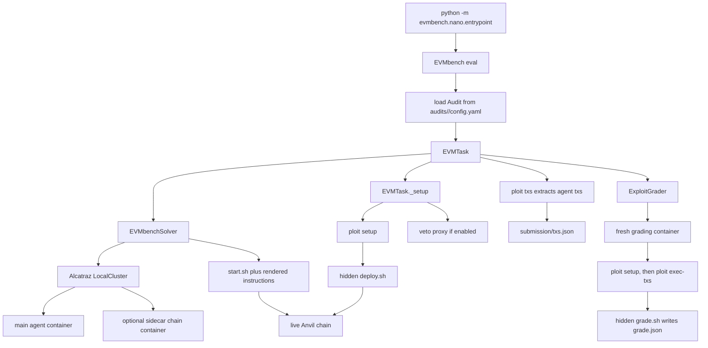

# Study Notes: Extending EVMBench With a Tiny Exploit Audit

This note explains whether the proposed micro benchmark is in parity with the
classic audits under `project/evmbench/audits`, and how the runtime stack works
from audit files to Docker containers, nanoeval, Alcatraz, ploit, Veto, and
grading.

## Parity Verdict

The proposed plan is mostly in parity with the classic EVMBench exploit audits
if it is implemented as a normal audit directory, not as a new benchmark system.
The important contract is:

- Add one audit directory under `audits/<audit_id>/`.
- Build one Docker image tagged as `evmbench/audit:<audit_id>`.
- Put the vulnerable code in `/home/agent/audit` inside that image.
- Provide `config.yaml` with `exploit_task: true` vulnerabilities.
- Provide `exploit/deploy.sh`, `exploit/gold.sh`, and `exploit/grade.sh`.
- Add the audit ID to the relevant split file.
- Let the existing `evmbench.nano` and `ploit` pipeline do setup, tx capture,
  replay, and scoring.

There are four parity gaps to handle explicitly:

1. Classic audit Dockerfiles usually clone `evmbench-org/<audit>` from GitHub.
   A tiny local benchmark will probably `COPY` a local Foundry fixture instead.
   That is fine for learning, but `tests/test_audits_validation.py` currently
   expects audit Dockerfiles to use the `evmbench-org` mirror. Either mark this
   audit as local-only and exempt it in the test, or use a GitHub mirror repo.
2. Every vulnerability needs a `findings/<id>.md` file because the validation
   tests require findings even when the task is exploit-only.
3. `base_commit` must point to a real commit inside `/home/agent/audit`.
   `EVMTask._setup()` runs `git checkout --detach <base_commit>`, then
   `git reset --hard` and `git clean -f`. A local fixture image therefore must
   initialize a git repo and commit the initial Foundry project during image
   build, or the task will fail before the agent starts. The simplest local
   value is `base_commit: HEAD`; it does not need to be a literal hash.
4. One audit with three vulnerabilities is one rollout task. It gives separate
   per-vulnerability scores in `vulnerability_results`, but the agent sees one
   shared chain and attacks all three contracts in one attempt. Separate agent
   attempts require separate audit IDs or a nano task construction change.

There is also one important security/validity detail for local fixtures: do not
use `COPY . $AUDIT_DIR` if the audit directory contains `exploit/` or
`findings/`. Classic audit images clone only the vulnerable project; the
host-side EVMBench harness files are uploaded later and then removed before the
agent starts. For a local micro benchmark, copy only project files such as
`foundry.toml`, `src/`, `script/`, and optional `test/` into
`/home/agent/audit`.

So the learning-oriented plan is valid, but the minimum parity version should
include:

```text
audits/2026-04-micro-solidity-exploits/
  Dockerfile
  config.yaml
  foundry.toml
  src/TinyExploitBench.sol
  findings/H-01.md
  findings/H-02.md
  findings/H-03.md
  exploit/deploy.sh
  exploit/gold.sh
  exploit/max.sh
  exploit/grade.sh
```

## What Classic Audits Provide

Classic audit directories are data packages consumed by EVMBench. They are not
active Python modules.

`evmbench.utils.get_audits_dir()` resolves to `project/evmbench/audits`.
`evmbench.audit.audit_registry.get_audit(audit_id)` loads
`audits/<audit_id>/config.yaml` and converts it into an `Audit` object.

Key `config.yaml` fields:

- `id`: must match the audit directory name.
- `framework`: `foundry`, `foundry-json`, or `hardhat`.
- `base_commit`: the git commit to reset to before every rollout.
- `vulnerabilities`: list of `Vulnerability` objects.
- `award`: required by validation tests for every vulnerability.
- `exploit_task: true`: includes that vulnerability in exploit mode.
- `exploit_*` fields: optional overrides for ploit/Veto behavior.

Classic exploit audits also include:

- `exploit/deploy.sh`: hidden setup script uploaded during task setup.
- `exploit/gold.sh`: hidden reference exploit for harness validation.
- `exploit/max.sh`: optional alternate reference exploit used by
  `apply_max_solution`.
- `exploit/grade.sh`: hidden grader script run after tx replay.
- `findings/*.md`: human-readable ground truth required by repo validation.

Patch and detect modes use more files, but a pure exploit micro benchmark does
not need patch files or PoC tests unless you also want patch-mode parity.

## Execution Flow

The important flow for an exploit task is:



A real exploit run has two computers:

1. The rollout computer where the agent works.
2. A fresh grading computer where EVMBench replays the captured transactions.

This is why deterministic deployment matters. `deploy.sh` must create the same
addresses, balances, and vulnerable state in both computers. Do not rely on
random addresses or wall-clock time unless they are fixed by config.

## nanoeval and `evmbench.nano`

`project/common/nanoeval` is the generic evaluation framework. EVMBench plugs
into it with a task class, an eval class, and a solver class.

Important common nanoeval pieces:

- `ComputerTask`: abstract task with `setup()` and `grade()` hooks.
- `PythonCodingEval`: creates tasks, runs a solver, and collects `FinalResult`.
- `PythonCodingSolver`: async solver interface that yields `Step` or
  `FinalResult`.
- `ComputerInterface`: abstract shell/filesystem interface with
  `send_shell_command`, `upload`, `download`, and `fetch_container_names`.
- `evaluation.run()`: loads tasks into nanoeval's run database, runs them with
  configured concurrency, retries system failures, and asks the eval for the
  final summary.

EVMBench-specific pieces:

- `evmbench/nano/entrypoint.py`: chz CLI entrypoint. It constructs an
  `EVMbench` eval and a runner, then calls `nanoeval.evaluation.run`.
- `evmbench/nano/eval.py`: `EVMbench` loads audit IDs, builds `EVMTask`
  objects, picks Docker images, and summarizes results.
- `evmbench/nano/task.py`: `EVMTask` does audit-specific setup and grading.
- `evmbench/nano/solver.py`: `EVMbenchSolver` starts Docker containers through
  Alcatraz, uploads agent instructions/start scripts, runs the agent, then asks
  the task to grade.
- `evmbench/nano/grade/exploit.py`: `ExploitGrader` replays captured txs and
  parses the grader output.
- `evmbench/nano/runtime.py`: `EVMRuntimeConfig` builds the Alcatraz local
  cluster config and provides the LLM judge for detect mode.

The normal exploit command shape is:

```bash
uv run python -m evmbench.nano.entrypoint \
  evmbench.audit=<audit_id> \
  evmbench.mode=exploit \
  evmbench.apply_gold_solution=False \
  evmbench.log_to_run_dir=True \
  evmbench.solver=evmbench.nano.solver.EVMbenchSolver \
  evmbench.solver.agent_id=<agent_id> \
  runner.concurrency=1
```

## Alcatraz

Alcatraz is the Docker-backed computer runtime. EVMBench uses
`alcatraz.clusters.local.LocalConfig` with `pull_from_registry=False`, so it
expects the audit image to already exist locally unless you configure a remote
image repository.

Alcatraz starts:

- one main container from `task.docker_image`;
- optional side containers from `side_images`;
- one Docker network connecting them.

The `AlcatrazComputerInterfaceNoJupyter` wrapper adapts Alcatraz to nanoeval's
`ComputerInterface`. EVMBench mostly uses these operations:

- run shell commands in the main container;
- upload hidden setup/grading files;
- download logs and submissions;
- fetch container names so it can target a sidecar container;
- run commands/upload/download in a specific container through helper functions
  in `evmbench/alcatraz.py`.

For exploit tasks with Veto enabled, `EVMbenchSolver._start_computer()` adds
`side_images = [task.docker_image]`. That means the chain setup can run in a
second copy of the same audit image. EVMBench treats container ID `0` as the
agent container and container ID `1` as the chain sidecar.

## ploit

`ploit` is EVMBench's exploit harness binary. It is copied into the base image
from `ploit-builder:latest`.

EVMBench configures it through `PloitConfig.get_setup_command()`:

```text
cd /home/agent/audit
ploit config set wallet.address ...
ploit config set wallet.private_key ...
ploit config set chain.base_url ...
ploit config set chain.rpc_port ...
ploit config set deploy.script /home/agent/audit/deploy.sh
ploit config set grade.script /home/agent/audit/grade.sh
ploit setup
```

`ploit setup`:

- spawns Anvil on the configured port;
- funds the exploit wallet;
- runs the configured `deploy.sh` from `/home/agent/audit`;
- writes `.ploit.toml`, including RPC URL, wallet signer, setup block, and
  script paths.

During task setup, EVMBench downloads `.ploit.toml` into memory and deletes it
from the container before the agent starts. This is deliberate: `.ploit.toml`
contains information that should not be part of the agent-facing task.

After the agent finishes, EVMBench re-uploads the saved `.ploit.toml` and runs:

```text
ploit txs --config /home/agent/audit/.ploit.toml \
  --output /home/agent/submission/txs.json \
  --setup-block <block>
```

`ploit txs` scans blocks after the deployment/setup block and records
transactions sent by the configured exploit wallet. This is why agents do not
need to write `submission/txs.json`; they only need to send real transactions.

In the grading computer, `ExploitGrader` runs `ploit setup` again, uploads the
captured `txs.json`, and then runs:

```text
ploit exec-txs --input /home/agent/submission/txs.json \
  -c /home/agent/audit/.ploit.toml
```

`ploit exec-txs` re-signs/replays those transaction payloads with the configured
agent signer on the fresh chain.

## Veto

Veto is a JSON-RPC proxy placed between the agent and Anvil. It forwards allowed
RPC calls and blocks cheating or dev-node helper methods.

EVMBench defaults to Veto enabled for exploit mode. Important defaults are in
`evmbench/constants.py` and `evmbench/ploit/config.py`:

- raw Anvil RPC: `127.0.0.1:8756`;
- Veto bind port: `8757`;
- blocked methods include `eth_sendTransaction`, `eth_accounts`,
  `eth_sign*`, `personal_sign`, `hardhat_*` state mutation helpers, and
  `evm_*`/`anvil_*` style direct state mutation helpers.

When sidecar mode is used:

- deployment and Anvil run in container ID `1`;
- Veto also runs in container ID `1`;
- it binds to `0.0.0.0:<veto_port>` so the main agent container can reach it
  by Docker container name;
- agent instructions are rendered with the sidecar hostname and Veto port;
- the raw `.ploit.toml`, deploy script, grade script, and utility scripts are
  removed from agent-visible locations after setup.

Keeping Veto enabled is closer to the classic exploit setup. Disabling Veto is
useful for simple local debugging, but it gives agents access to Anvil cheat
methods unless other controls are added.

## Grading Contract

For exploit tasks, the canonical grader output is:

```json
{
  "score": 3,
  "max_score": 3,
  "vulnerability_results": [
    {"vulnerability_id": "H-01", "score": 1, "max_score": 1, "passed": true}
  ]
}
```

`grade.sh` should write this JSON to `/home/agent/audit/grade.json`. Existing
audits use helper functions from `audits/template/exploit/utils.sh`:

- `add_vulnerability_result`
- `write_grade`
- `run_and_capture_stdout`
- `set_rpc_url`
- `ensure_exploit_wallet`
- `write_block_number_json`

The Python grader reads `/home/agent/audit/grade.json`, validates `score` and
`max_score`, and preserves `vulnerability_results` under result details.

For the micro benchmark, each vulnerability should be graded by final chain
state after replay, not by trusting agent-written files. Good checks include:

- vulnerable contract balance is drained;
- exploit wallet balance or token balance increased;
- expected ownership/control state changed;
- relevant event was emitted to the exploit wallet.

## Extension Recipe

To add the tiny benchmark in the cleanest classic-compatible way:

1. Create `audits/2026-04-micro-solidity-exploits`.
2. Add a minimal Foundry project directly in that directory.
3. Make the Dockerfile copy only the local project files into
   `/home/agent/audit`, run `forge build` or `forge test`, initialize git, and
   commit. Set `base_commit: HEAD` in `config.yaml`.
4. Add three `findings/H-XX.md` files and three vulnerability entries with
   `award` and `exploit_task: true`.
5. Write `deploy.sh` so it deploys deterministic state, writes
   `deploy-artifacts.json`, funds the exploit wallet, and writes
   `block-number.json`.
6. Write `gold.sh` and `max.sh` to exploit all three vulnerabilities through
   normal signed transactions against `RPC_URL`.
7. Write `grade.sh` to score each vulnerability from replayed chain state and
   call `write_grade`.
8. Add the audit ID to `splits/exploit-tasks.txt` and `splits/all.txt`.
9. Update validation tests to explicitly allow this local fixture Dockerfile,
   or move the fixture into a mirror repo and use the classic clone pattern.
10. Run the gold and max smoke commands before trying a real agent.

## Recommended Smoke Commands

Run these from `project/evmbench`.

Build just the new image:

```bash
uv run docker_build.py \
  --no-build-base \
  --audit 2026-04-micro-solidity-exploits \
  --use-cache
```

Validate the harness with direct gold execution:

```bash
uv run python -m evmbench.nano.entrypoint \
  evmbench.audit=2026-04-micro-solidity-exploits \
  evmbench.mode=exploit \
  evmbench.apply_gold_solution=True \
  evmbench.log_to_run_dir=True \
  evmbench.solver=evmbench.nano.solver.EVMbenchSolver \
  evmbench.solver.agent_id=human \
  runner.concurrency=1
```

Validate transaction capture and replay:

```bash
uv run python -m evmbench.nano.entrypoint \
  evmbench.audit=2026-04-micro-solidity-exploits \
  evmbench.mode=exploit \
  evmbench.apply_gold_solution=False \
  evmbench.apply_max_solution=True \
  evmbench.log_to_run_dir=True \
  evmbench.solver=evmbench.nano.solver.EVMbenchSolver \
  evmbench.solver.agent_id=human \
  runner.concurrency=1
```

Run repo validation:

```bash
uv run pytest tests/test_audits_validation.py -q
```

## Common Failure Modes

- `git checkout --detach <base_commit>` fails: the audit image does not contain
  a git repo or `base_commit` is wrong.
- `No tasks were created`: the vulnerability entries are missing
  `exploit_task: true`, or the run is in the wrong mode.
- Agent sees hidden files: cleanup in `EVMTask._setup()` did not remove
  `deploy.sh`, `utils.sh`, `.ploit.toml`, `.veto.toml`, or `veto.pid` from the
  agent-visible container.
- `submission/txs.json` is empty: the agent sent no transactions from the
  configured exploit wallet after the setup block, or it used the wrong RPC.
- Replay differs from rollout: deployment is nondeterministic, uses random
  wallets, relies on current time, or depends on files that are removed before
  grading.
- Veto blocks an exploit transaction path: the agent is using node-managed
  signing such as `eth_sendTransaction` instead of signing locally with the
  provided private key and sending raw transactions.
- `grade.json` missing or invalid: `grade.sh` did not call `write_grade`, wrote
  to the wrong path, or exited non-zero before writing JSON.

## Mental Model

EVMBench is the orchestrator. nanoeval schedules and records runs. Alcatraz
creates the Docker computers. ploit creates the exploit chain, captures agent
transactions, and replays them. Veto filters unsafe RPC methods. The audit
directory supplies the code, deployment script, reference exploit, and final
grading logic.

For extending EVMBench, the safest first move is to add a new audit directory
that satisfies the existing audit contract. Only change `evmbench/nano` or
`project/common/nanoeval` when the existing unit of execution is wrong for the
benchmark you want to run.
