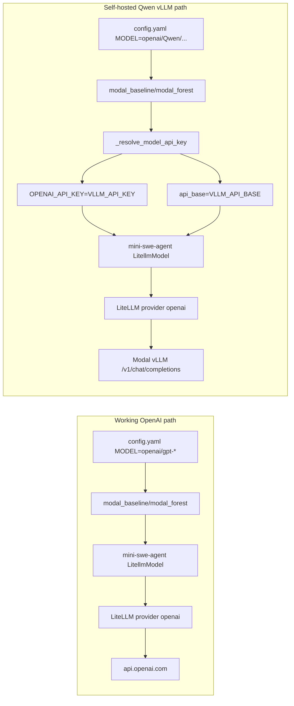
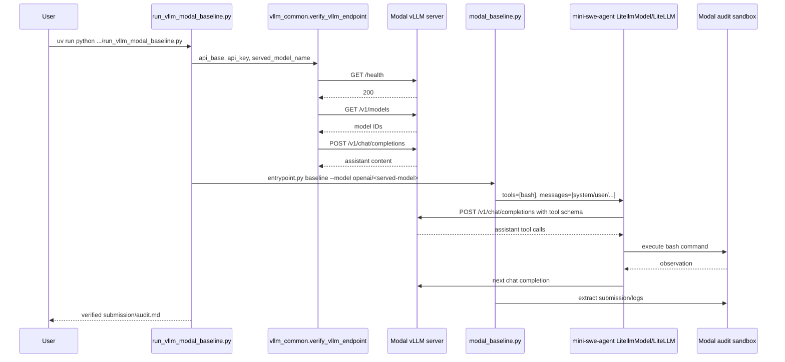
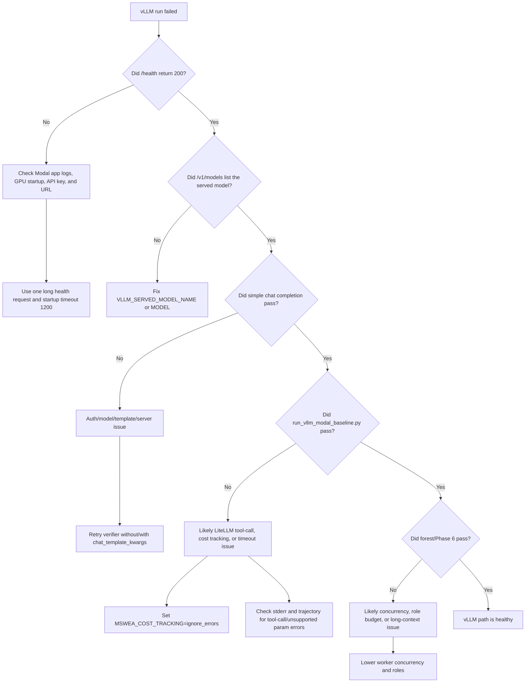

# mini-swe-agent vLLM Troubleshooting Guide

Use this guide to understand the `evmbench/agents/mini-swe-agent` folder and to
debug the specific case where normal OpenAI API runs work, but a self-hosted
Qwen vLLM auth endpoint does not.

Run commands from `project/evmbench` unless a command says otherwise.

## One-Screen Diagnosis

| If OpenAI works but vLLM fails | Most likely cause | Fast check | Usual fix |
| --- | --- | --- | --- |
| `/health` works, agent fails with auth | Local `.env` key differs from Modal secret key | Re-run endpoint verification with the exact local key | `setup_vllm_modal_env.py --no-write-env` or `deploy_vllm_server.py --sync-secret` |
| `/v1/models` works, chat says model missing | Client model does not equal served model | Compare `/v1/models` IDs to `MODEL` after removing `openai/` | Set `VLLM_SERVED_MODEL_NAME` and `MODEL` consistently |
| Direct `curl` chat works, mini-swe-agent fails | Agent sends tool-call schema through LiteLLM, not the simple smoke payload | Run the mini-swe-agent baseline wrapper, not only curl | Configure vLLM/tool parser compatibility or reduce to a no-tool test |
| Registered Phase 6 vLLM variant fails on H100 | Config uses BF16 model name while H100 deploy defaults to FP8 | Check `VLLM_MODEL`, `VLLM_SERVED_MODEL_NAME`, and `config.yaml` | Use `openai/Qwen/Qwen3.6-35B-A3B-FP8` or deploy BF16 explicitly |
| Works at first, then forest fails | One vLLM server is overloaded by parallel workers | Check forest worker concurrency and vLLM `max_num_seqs` | Lower `FOREST_WORKER_CONCURRENCY` and role count |
| Server never reaches ready | Modal cold start/model compile exceeds timeout | Tail `modal app logs --timestamps evmbench-vllm-qwen` | Use `--startup-timeout-seconds 1200` and avoid repeated health polling |

## Folder Inventory

| File | Role | Important behavior |
| --- | --- | --- |
| `config.yaml` | Agent registry config | Defines local, Modal, forest, GPT, and Qwen vLLM variants. Qwen variants resolve `MODEL` and role models from `VLLM_LITELLM_MODEL`. |
| `deploy_vllm.py` | Modal vLLM app | Runs `vllm serve`, attaches the `evmbench-vllm-token` secret, exposes `/health` and `/v1/*`, and sets Qwen reasoning/template flags. |
| `deploy_vllm_server.py` | Deploy/verify CLI | Resolves GPU/model defaults, optionally syncs secrets, deploys Modal, verifies `/health`, `/v1/models`, and `/v1/chat/completions`. |
| `entrypoint.py` | Runner dispatcher | Dispatches `baseline`, `forest`, or `smoke`; defaults to `forest`. |
| `evaluate_phase6.py` | Evaluation harness | Builds runner/audit matrices, streams logs, captures return codes, and writes summary JSON/Markdown/CSV. |
| `judge.py` | Forest prompt helper | Defines branch, tree-judge, and global-judge prompts plus artifact paths for detect/patch/exploit. |
| `modal_baseline.py` | Single-agent Modal runner | Runs one mini-swe-agent loop against one Modal sandbox and maps vLLM env into LiteLLM/OpenAI-compatible settings. |
| `modal_compat.py` | Modal compatibility patch | Patches SWE-ReX Modal image building for current Modal SDK registry secret behavior. |
| `modal_forest.py` | Multi-agent forest runner | Runs scout, branch workers, tree judges, and global judge with optional parallelism. |
| `modal_smoke.py` | Modal no-LLM smoke | Uses a deterministic mini-swe-agent model to verify Modal sandbox execution and artifact extraction. |
| `run_phase6_modal_forest.sh` | Forest wrapper | Runs only the normal Modal forest variant through `evaluate_phase6.py`. |
| `run_phase6_modal_forest_gpt52_codex_8trees.sh` | 8-tree GPT wrapper | Runs the GPT-5.2 Codex eight-tree forest variant. |
| `run_phase6_variants.sh` | Generic Phase 6 wrapper | Loads `.env`, sets audit image repo defaults, and delegates to `evaluate_phase6.py`. |
| `run_smoke_trace_recovery.sh` | Trace recovery smoke | Runs a tiny forest job and reports recovered trajectories/metadata after failure or success. |
| `run_vllm_baseline_detect.sh` | Shell vLLM baseline | Curls vLLM health/chat, then runs the baseline runner with vLLM env. |
| `run_vllm_modal_baseline.py` | Python vLLM baseline | Verifies the endpoint, runs baseline, checks submission, and writes wrapper metadata. |
| `run_vllm_smoke.sh` | vLLM forest smoke | Optionally deploys/downloads/skips vLLM setup, checks endpoint, then runs a capped forest smoke. |
| `scout.py` | Forest role catalog | Defines specialist tree roles and scout decision parsing/fallbacks. |
| `setup_vllm_modal_env.py` | Env/secret setup | Creates or rotates `VLLM_API_KEY`, syncs Modal secret, resolves app URL, and writes `.env`. |
| `start.sh` | Local/container runner | Maps `VLLM_API_BASE`/`VLLM_API_KEY` into OpenAI-compatible LiteLLM env, writes `model_kwargs.api_base`, and runs the mini-swe-agent CLI. |
| `vllm_common.py` | Shared vLLM utilities | Handles URL conversion, env loading, secret upserts, endpoint verification, and `.env`/metadata writes. |

## Runtime Planes

| Plane | Runs where | Responsible files | Auth source | Failure style |
| --- | --- | --- | --- | --- |
| vLLM server | Modal GPU container | `deploy_vllm.py` | Modal secret `evmbench-vllm-token` key `VLLM_API_KEY` | 401/403, cold start, model load/serve failure |
| Endpoint verifier | Local host process | `deploy_vllm_server.py`, `vllm_common.py`, `run_vllm_*` | Local `.env` or flags | Health/models/chat verification errors |
| Agent orchestrator | Local host process | `modal_baseline.py`, `modal_forest.py` | `VLLM_API_KEY` remapped to `OPENAI_API_KEY` | LiteLLM auth/model/tool errors |
| Audit sandbox | Modal audit image | SWE-ReX `SwerexModalEnvironment` | Optional env from orchestrator | Shell command/runtime/artifact errors |
| EVMBench harness | Local host process | `evaluate_phase6.py`, `modal_runner.py` | Inherited process env and agent config | Missing output dir, missing submission, nonzero runner exit |

## High-Level Architecture

```mermaid
flowchart TD
    A[.env] --> B[setup_vllm_modal_env.py]
    A --> C[deploy_vllm_server.py]
    B --> D[Modal secret: evmbench-vllm-token]
    C --> D
    C --> E[modal deploy deploy_vllm.py]
    D --> F[Modal GPU vLLM server]
    E --> F
    F --> G[/health]
    F --> H[/v1/models]
    F --> I[/v1/chat/completions]
    C --> J[vllm_common.verify_vllm_endpoint]
    J --> G
    J --> H
    J --> I
    J --> K[runs/vllm-server/latest-deploy.json]
```

## OpenAI Path vs vLLM Path



Key point: the vLLM path intentionally pretends to be OpenAI-compatible. That is
why the model is named `openai/<served-model-name>` and why `VLLM_API_KEY` is
copied into `OPENAI_API_KEY`.

## Successful vLLM Baseline Sequence



## Why Curl Can Pass But the Agent Still Fails

The endpoint verifier sends a minimal chat request:

```json
{
  "model": "Qwen/Qwen3.6-35B-A3B-FP8",
  "messages": [{"role": "user", "content": "Reply with exactly: ok"}],
  "max_tokens": 16,
  "temperature": 0,
  "chat_template_kwargs": {"enable_thinking": false}
}
```

The mini-swe-agent request is materially different:

```mermaid
flowchart TD
    A[DefaultAgent] --> B[LitellmModel.query]
    B --> C[litellm.completion]
    C --> D[model=openai/<served-model>]
    C --> E[tools=[BASH_TOOL]]
    C --> F[model_kwargs.api_base=VLLM_API_BASE]
    D --> G[OpenAI-compatible vLLM endpoint]
    E --> G
    F --> G
```

So a passing `curl` proves authentication, routing, and basic chat. It does not
prove Qwen/vLLM can follow the mini-swe-agent tool-call loop.

## Model Name Matrix

| Serving profile | vLLM checkpoint | Served model name | LiteLLM model name |
| --- | --- | --- | --- |
| Default single H100 | `Qwen/Qwen3.6-35B-A3B-FP8` | `Qwen/Qwen3.6-35B-A3B-FP8` | `openai/Qwen/Qwen3.6-35B-A3B-FP8` |
| B200 BF16 | `Qwen/Qwen3.6-35B-A3B` | `Qwen/Qwen3.6-35B-A3B` | `openai/Qwen/Qwen3.6-35B-A3B` |
| H100:2 BF16 | `Qwen/Qwen3.6-35B-A3B` | `Qwen/Qwen3.6-35B-A3B` | `openai/Qwen/Qwen3.6-35B-A3B` |
| Custom alias | Any checkpoint | Example: `qwen-auditor` | `openai/qwen-auditor` |

Rule: `MODEL` for LiteLLM must be `openai/<exact served_model_name>`.

## Bottleneck Matrix

| Bottleneck | Where it enters | Symptom | Confirm with | Fix |
| --- | --- | --- | --- | --- |
| Auth secret drift | `setup_vllm_modal_env.py`, `deploy_vllm_server.py`, `deploy_vllm.py` | 401/403 from `/health`, `/models`, or chat | `deploy_vllm_server.py --skip-deploy` | Sync current key with `setup_vllm_modal_env.py --no-write-env` or redeploy with `--sync-secret` |
| Missing `VLLM_API_KEY` when `VLLM_API_BASE` is set | `modal_baseline._resolve_model_api_key` | Runtime error before agent starts | Inspect `.env` | Set both `VLLM_API_BASE` and `VLLM_API_KEY` |
| Served/client model mismatch | `deploy_vllm_server.py`, `config.yaml`, `vllm_common.litellm_model_name` | 404/model not found, verifier warning, or failed completion | `curl "$VLLM_API_BASE/models"` | Align `VLLM_SERVED_MODEL_NAME` and `MODEL` |
| H100 FP8 default vs BF16 config | `deploy_vllm_server.py` default profile, `config.yaml` Qwen variants | Registered vLLM variant asks for non-served model | Print `latest-deploy.json` and `MODEL` | Use FP8 LiteLLM name or force BF16 deploy profile |
| Tool-call incompatibility | Installed `minisweagent.models.litellm_model.LitellmModel` | Direct chat works, agent cannot issue valid bash tool calls | Run `run_vllm_modal_baseline.py` after direct verify | Test one mini-swe-agent step; configure vLLM chat/tool parser if required |
| Cost lookup for unknown Qwen model | `LitellmModel._calculate_cost` | Cost tracking exception after response | Check trajectory/stderr for cost calculator error | Use `MSWEA_COST_TRACKING=ignore_errors` |
| Cold-start timeout | Modal/vLLM startup | Health request hangs or Modal web server never becomes ready | `modal app logs --timestamps evmbench-vllm-qwen` | Use `--startup-timeout-seconds 1200`; avoid repeated health polling |
| Parallel forest overload | `modal_forest.py`, `config.yaml` | Some workers time out or return server errors | Compare worker errors in `modal-forest-result.json` | Lower `FOREST_WORKER_CONCURRENCY`, roles, branches, or vLLM `max_num_seqs` |
| Stale runner checkout | `start.sh` vs Modal runners | Local runner ignores `api_base` or fails missing `OPENAI_API_KEY` despite vLLM vars | Check generated `/home/agent/mini-override.yaml` has `model_kwargs.api_base` | Use the updated `start.sh` or Modal vLLM wrappers |
| API base path confusion | `.env`, wrappers | Requests go to wrong path like `/v1/v1/chat/completions` or root chat path | Print `VLLM_API_BASE` and `server_root` | Store `VLLM_API_BASE=https://.../v1`; derive server root by stripping `/v1` |

## Debug Decision Tree



## Fix Procedure

### 1. Load Environment

```bash
cd project/evmbench
set -a
. ./.env
set +a
```

Check that both values exist:

```bash
test -n "${VLLM_API_BASE:-}" && echo "VLLM_API_BASE=$VLLM_API_BASE"
test -n "${VLLM_API_KEY:-}" && echo "VLLM_API_KEY length=${#VLLM_API_KEY}"
```

### 2. Sync Auth Before Redeploying

Use this when the endpoint exists but you suspect a token mismatch:

```bash
uv run evmbench/agents/mini-swe-agent/setup_vllm_modal_env.py --no-write-env
```

Use this when deploying and explicitly syncing the current local key:

```bash
uv run evmbench/agents/mini-swe-agent/deploy_vllm_server.py \
  --sync-secret \
  --startup-timeout-seconds 1200 \
  --scaledown-window-seconds 120 \
  --wait-timeout 1800
```

### 3. Verify Server Without Agent Logic

```bash
uv run evmbench/agents/mini-swe-agent/deploy_vllm_server.py \
  --skip-deploy \
  --wait-timeout 1800 \
  --request-timeout 300 \
  --chat-timeout 600
```

If this fails, fix server/auth/model first. Do not debug mini-swe-agent yet.

### 4. Confirm Model Names Match

```bash
curl --fail --silent --show-error \
  --header "Authorization: Bearer ${VLLM_API_KEY}" \
  "${VLLM_API_BASE%/}/models" | python -m json.tool
```

Then set the client model to the exact served ID:

```bash
export MODEL="openai/${VLLM_SERVED_MODEL_NAME}"
```

For the default H100 FP8 profile, that is usually:

```bash
export VLLM_SERVED_MODEL_NAME="Qwen/Qwen3.6-35B-A3B-FP8"
export MODEL="openai/Qwen/Qwen3.6-35B-A3B-FP8"
```

### 5. Test the Real mini-swe-agent Path

This is the important step. It uses LiteLLM, the bash tool schema, and the Modal
baseline runner.

```bash
MSWEA_COST_TRACKING=ignore_errors \
uv run evmbench/agents/mini-swe-agent/run_vllm_modal_baseline.py \
  --audit-id 2024-01-canto \
  --skip-chat-check
```

If this fails while direct chat passed, inspect:

| Artifact | What to look for |
| --- | --- |
| `<output-dir>/logs/mini-swe-agent.traj.json` | The actual LiteLLM response, tool calls, and failure step |
| `<output-dir>/logs/modal-baseline-result.json` | Runtime, error string, and extracted artifacts |
| Wrapper stdout/stderr | LiteLLM `AuthenticationError`, `NotFoundError`, unsupported params, or cost tracking errors |
| `modal app logs --timestamps evmbench-vllm-qwen` | Server-side request errors and model/template exceptions |

### 6. Only Then Run Forest

Start with one role and one worker:

```bash
VLLM_DEPLOY_MODE=skip \
AUDIT_ID=2024-01-canto \
SCOUT_STEP_LIMIT=4 \
BRANCH_STEP_LIMIT=4 \
JUDGE_STEP_LIMIT=4 \
GLOBAL_STEP_LIMIT=4 \
FOREST_WORKER_CONCURRENCY=1 \
MSWEA_COST_TRACKING=ignore_errors \
evmbench/agents/mini-swe-agent/run_vllm_smoke.sh
```

Scale only after that passes:

| Scale knob | Starts safe at | Increase after |
| --- | ---: | --- |
| `FOREST_WORKER_CONCURRENCY` | `1` | Baseline and one-role forest pass |
| `MAX_TREE_ROLES` | `1` | No vLLM timeout/server errors |
| `BRANCHES_PER_TREE` | `1` | Tree-judge/global-judge stages complete |
| `VLLM_MAX_NUM_SEQS` | `8` on H100 FP8 | GPU memory is stable |

## Container Runner Variants

The local/container vLLM path uses the normal EVMBench container runner, so the
LLM loop runs inside the audit container through `start.sh` and `mini`.

| Runner slug | Agent ID | Intended use |
| --- | --- | --- |
| `mini-qwen-vllm-smoke-10` | `mini-swe-agent-qwen-vllm-smoke-10` | First container-runner smoke against vLLM. |
| `mini-qwen-vllm` | `mini-swe-agent-qwen-vllm` | Full step-limit container runner against vLLM. |
| `modal-baseline-qwen-vllm` | `mini-swe-agent-modal-baseline-qwen-vllm` | Modal single-agent baseline against vLLM. |
| `modal-forest-qwen-vllm-2trees-debug` | `mini-swe-agent-modal-forest-qwen-vllm-2trees-debug` | Small forest debug with scout, two tree roles, branch workers, tree judges, and global judge. |
| `modal-forest-qwen-vllm-4trees-debug` | `mini-swe-agent-modal-forest-qwen-vllm-4trees-debug` | Four-role forest debug against vLLM with worker concurrency 2. |
| `container-vllm` | Phase 6 group | Runs both container vLLM variants. |
| `modal-vllm-debug` | Phase 6 group | Runs the Qwen vLLM Modal baseline plus the 2-tree and 4-tree debug forest variants. |
| `vllm` | Phase 6 group | Runs container vLLM variants plus all Qwen vLLM Modal variants. |

Dry-run the command matrix:

```bash
uv run python evmbench/agents/mini-swe-agent/evaluate_phase6.py plan \
  --scope smoke \
  --runners container-vllm
```

Run the smoke variant once `VLLM_API_BASE` and `VLLM_API_KEY` are present:

```bash
uv run python -m evmbench.nano.entrypoint \
  evmbench.audit=2023-07-pooltogether \
  evmbench.mode=detect \
  evmbench.audit_split=detect-tasks \
  evmbench.solver.agent_id=mini-swe-agent-qwen-vllm-smoke-10 \
  runner.concurrency=1
```

## Source Hotspots

| Question | File to read first | Why |
| --- | --- | --- |
| Which model is being served? | `deploy_vllm_server.py` | `_resolve_server_config` changes defaults based on GPU profile. |
| Which key protects vLLM? | `deploy_vllm.py` | `serve()` passes `--api-key` from Modal secret. |
| Which key does the client send? | `modal_baseline.py` | `_resolve_model_api_key` remaps `VLLM_API_KEY` into OpenAI env vars. |
| Why does LiteLLM call vLLM? | `modal_baseline.py` | `_model_kwargs_with_vllm_api_base` injects `api_base`. |
| Why is the agent request different from curl? | `.venv/.../minisweagent/models/litellm_model.py` | `_query` always passes `tools=[BASH_TOOL]`. |
| Why did Phase 6 fail? | `evaluate_phase6.py` | It writes command logs and summarizes missing submissions/failures. |
| Why did only one forest worker fail? | `modal_forest.py` | Worker results and errors are stored in `modal-forest-result.json`. |

## Minimal Healthy Configuration

For the safest first pass on H100:

```bash
export VLLM_MODAL_GPU=H100
export VLLM_MODEL=Qwen/Qwen3.6-35B-A3B-FP8
export VLLM_SERVED_MODEL_NAME=Qwen/Qwen3.6-35B-A3B-FP8
export MODEL=openai/Qwen/Qwen3.6-35B-A3B-FP8
export VLLM_MAX_MODEL_LEN=32768
export VLLM_MAX_NUM_SEQS=8
export VLLM_DTYPE=auto
export MSWEA_COST_TRACKING=ignore_errors
export FOREST_WORKER_CONCURRENCY=1
```

Expected order of green checks:

```mermaid
flowchart LR
    A[setup/sync secret] --> B[deploy or skip-deploy verify]
    B --> C[/health 200]
    C --> D[/v1/models lists served model]
    D --> E[simple chat 200]
    E --> F[run_vllm_modal_baseline.py creates submission]
    F --> G[run_vllm_smoke.sh creates submission]
    G --> H[Phase 6 vllm runners]
```

## Common Fixes By Error Text

| Error text fragment | Meaning | Fix |
| --- | --- | --- |
| `AuthenticationError`, `401`, `Unauthorized` | Client key does not match Modal secret or key was not sent | Sync secret and confirm `OPENAI_API_KEY` is replaced with `VLLM_API_KEY` in vLLM runs |
| `model ... does not exist`, `NotFoundError` | `MODEL` does not match served model ID | Use `MODEL=openai/<id from /v1/models>` |
| `unsupported parameter` | LiteLLM/OpenAI-compatible payload includes a field vLLM rejects | Try direct verifier fallback, inspect mini-swe-agent request, remove extra model kwargs |
| `Error calculating cost` | LiteLLM does not know Qwen self-hosted pricing | `MSWEA_COST_TRACKING=ignore_errors` |
| `ContextWindowExceededError` | Prompt/history exceeded `VLLM_MAX_MODEL_LEN` | Raise max model len if feasible or reduce task/worker history |
| Missing `submission/audit.md` | Agent never completed benchmark contract | Inspect trajectory and worker metadata before changing server settings |

## Practical Rule

Do not treat a passing curl as the end of validation. The validation ladder is:

1. vLLM server accepts the key.
2. vLLM serves the exact model ID the client requests.
3. vLLM accepts a simple OpenAI-compatible chat request.
4. vLLM accepts mini-swe-agent's LiteLLM request with the bash tool schema.
5. The model actually emits usable tool calls and completes the EVMBench artifact.
6. The forest workload stays within vLLM concurrency and timeout limits.
