# Nanoeval, EVMBench Nano, Exploit Mode, and Containers

This guide explains the execution system behind EVMBench nano runs: how
`nanoeval` schedules work, how `evmbench.nano` turns audits into tasks, how
local Docker/Alcatraz and Modal runners differ, and how exploit-mode chains,
`ploit`, and `veto` fit into the container topology.

## Mental Model

There are three layers:

1. `nanoeval` is the control plane. It owns task scheduling, concurrency,
   persistence, retries, progress, recorder integration, and summaries.
2. `evmbench.nano` is the benchmark adapter. It creates `EVMTask` objects,
   prepares audit containers, runs the selected agent, extracts outputs, and
   grades detect, patch, or exploit results.
3. Agent/runtime code executes the work. It is either a local container agent
   inside an Alcatraz Docker cluster or a Modal runner that creates remote
   Modal sandboxes.

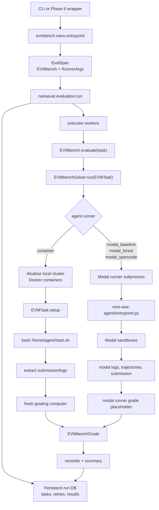

## Source Map

| Area | Main files | What they do |
| --- | --- | --- |
| Nano entrypoint | `evmbench/nano/entrypoint.py` | Builds `EvalSpec(eval=EVMbench, runner=RunnerArgs)` and calls `nanoeval.evaluation.run`. |
| EVMBench eval | `evmbench/nano/eval.py` | Builds audit tasks, run dirs, prompts, run group ids, and final summaries. |
| Solver | `evmbench/nano/solver.py` | Chooses local container vs Modal runner, prepares agents, runs agents, wraps system errors. |
| Task setup/grading | `evmbench/nano/task.py` | Sets up audit containers, exploit chain/veto state, extracts outputs, invokes graders. |
| Local runtime config | `evmbench/nano/runtime.py` | Builds Alcatraz `LocalConfig` for Docker-backed runs. |
| Network gateway | `evmbench/nano/gateway.py` | Creates HAProxy SNI allowlist sidecar and rewires local Docker networking. |
| Graders | `evmbench/nano/grade/*.py` | Detect uses an LLM judge, patch uses tests, exploit replays txs with `ploit`. |
| Agent registry | `evmbench/agents/agent.py` | Loads agent configs, runner type, env vars, start script, gateway allowlist. |
| Modal adapter | `evmbench/agents/modal_runner.py` | Converts agent config into a Modal runner subprocess command. |
| Modal forest | `evmbench/agents/mini-swe-agent/modal_forest.py` | Creates scout, branch, tree judge, and global judge Modal workers. |
| Exploit config | `evmbench/ploit/config.py` | Builds `ploit setup`, `ploit txs`, and `ploit exec-txs` commands. |
| Veto | `evmbench/ploit/veto.py` | Starts/stops JSON-RPC filtering proxy inside exploit containers. |

## Nanoeval Control Plane

`nanoeval` persists all work in a run database. Executor workers pull tasks from
that database, run `spec.eval.evaluate(task)`, save results, and let the driver
decide whether to summarize, retry, or finish.

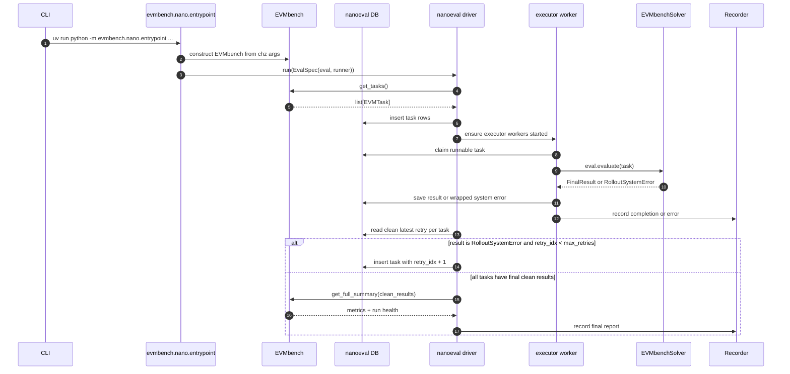

Important retry behavior:

- `RunnerArgs.max_retries` defaults to `16`.
- Only `RolloutSystemError` is retried.
- Other unhandled exceptions crash the eval.
- Clean results are deduped by `(question_id, attempt_id)` and use the largest
  `retry_idx`.
- `runner.concurrency` limits how many tasks run in parallel, but it does not
  limit retries.

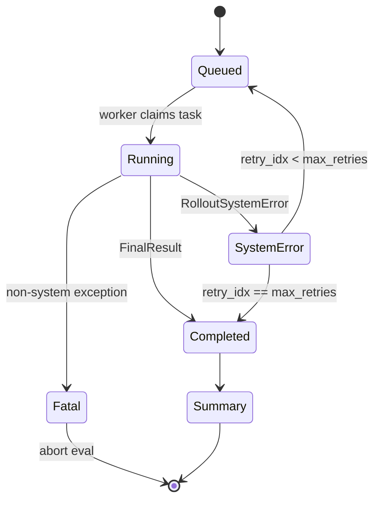

## EVMBench Nano Objects

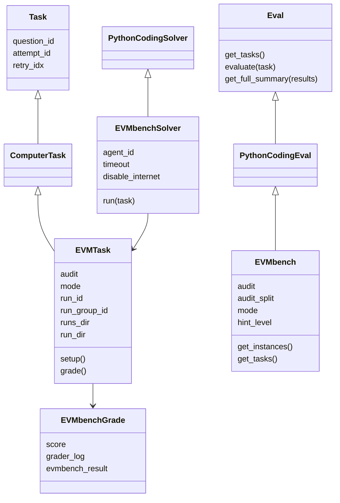

## End-To-End Local Container Run

This is the classic local/Docker path used when `agent.runner == "container"`.

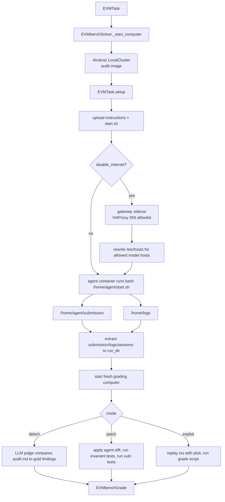

## Local Container Topology

The main container is always container id `0`. In exploit mode with veto enabled,
the solver adds the audit image as a sidecar too, giving a second container for
chain setup and RPC filtering.

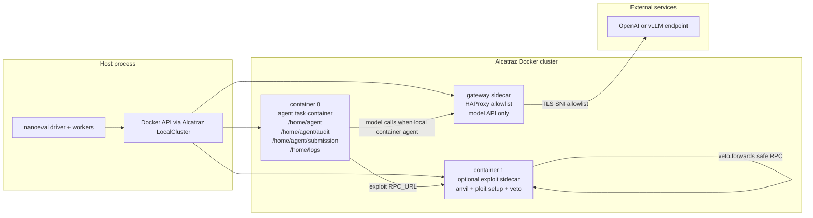

## Agent Runner Branches

The same `EVMbenchSolver.run` method handles local and Modal agents, but the
paths are very different.

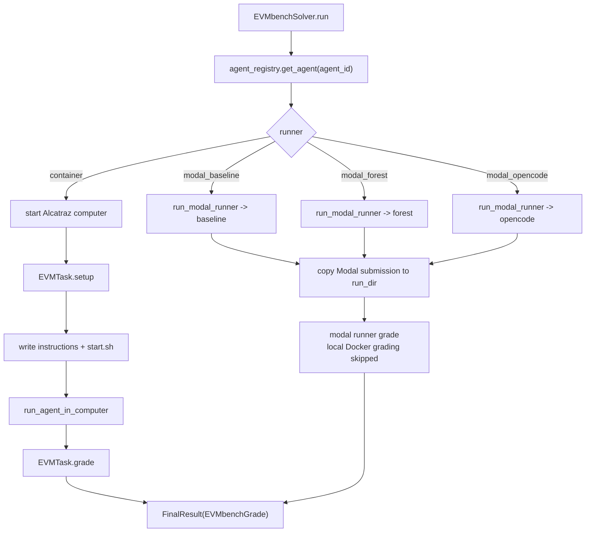

## Detect, Patch, and Exploit Modes

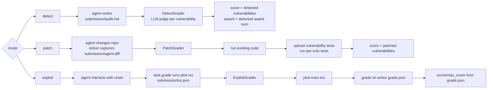

## Exploit Mode Detailed Flow

Exploit mode has two phases: the agent phase and the grading replay phase.

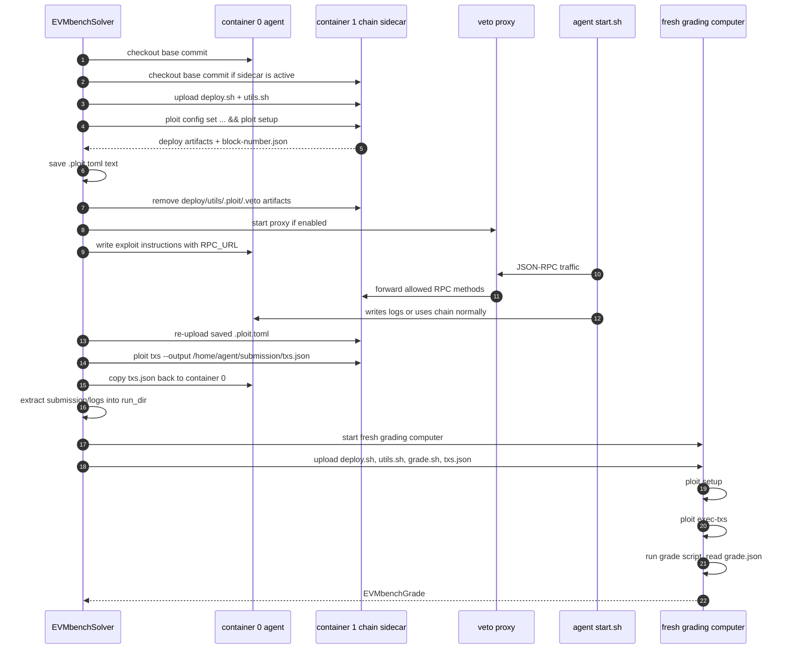

The point of `veto` is to prevent cheap RPC cheating against the local dev
chain. By default it blocks methods such as `eth_sendTransaction`, account
enumeration/signing methods, and direct state mutation helpers like
`hardhat_setStorageAt` and `evm_setAccountBalance`.

## Modal Forest Topology

Modal forest is not one sandbox. It is a set of independent worker sandboxes.
Each worker gets an audit image, SWE-ReX runtime access, role instructions, and
model credentials. The forest coordinator copies back artifacts and trajectories.

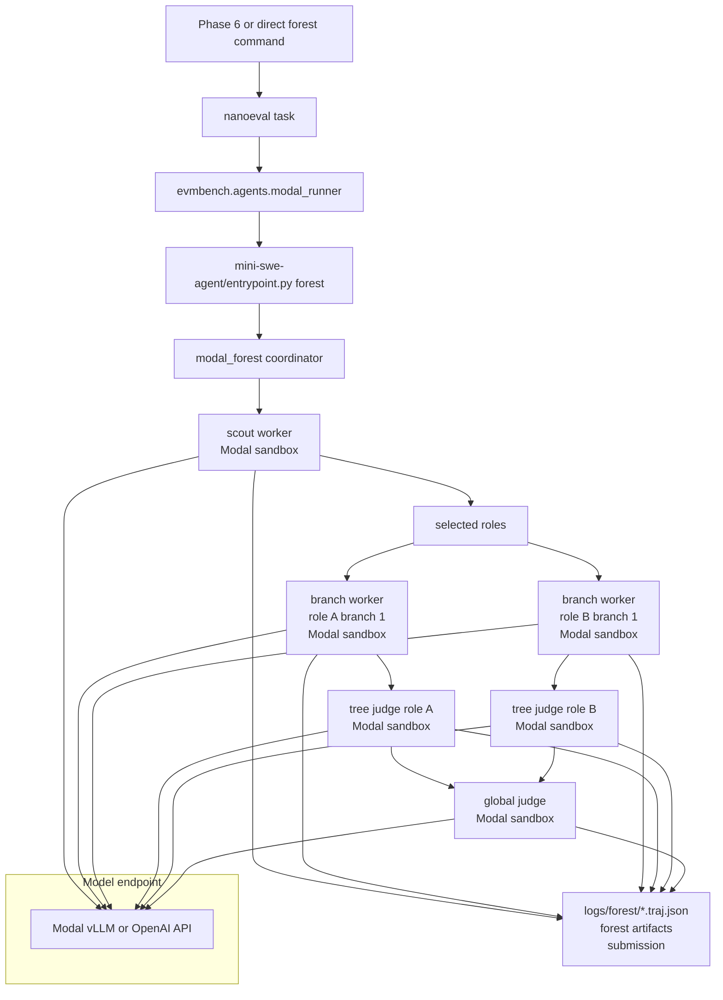

Formula for Modal forest worker count per full attempt:

```text
workers_per_attempt = 1 scout
                    + (roles * branches_per_tree)
                    + roles tree_judges
                    + 1 global_judge
```

For a 2-role, 1-branch run:

```text
1 + (2 * 1) + 2 + 1 = 6 Modal sandboxes per full attempt
```

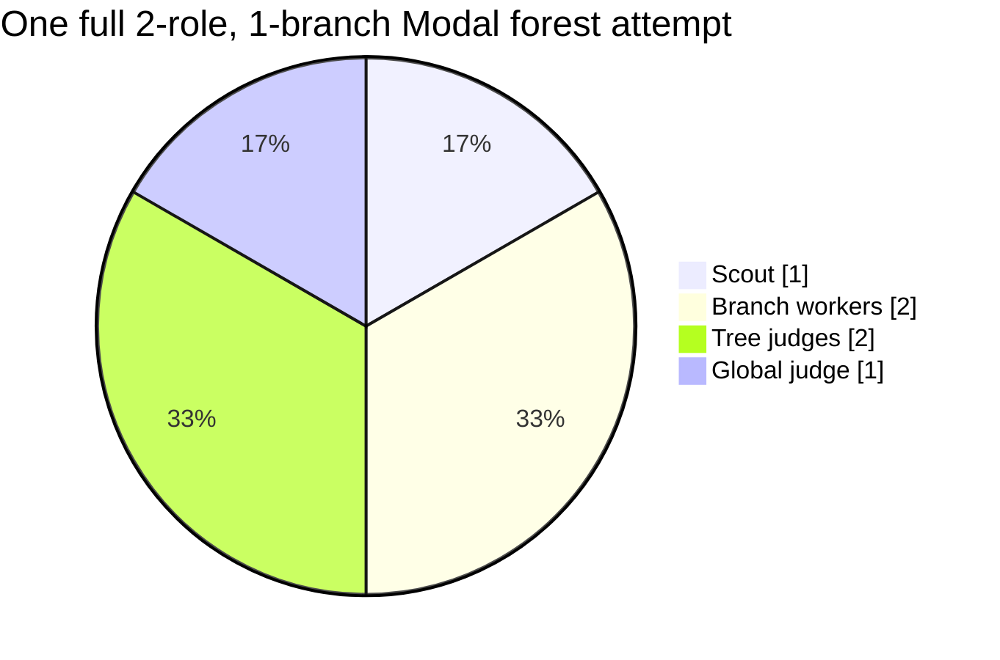

## Retry And Sandbox Growth

Retries multiply whole attempts. They are not just extra model calls.

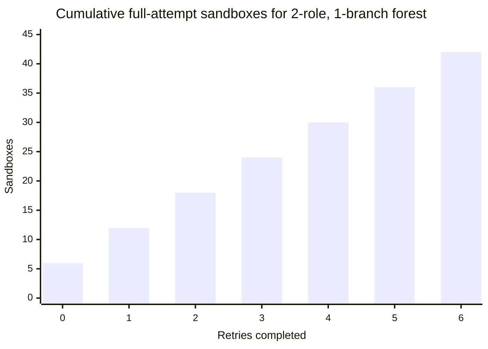

Interpretation:

- `0` retries completed means the first attempt ran once: 6 sandboxes.
- `5` retries completed means 6 full attempts: 36 sandboxes.
- A partial seventh attempt can add 1 or more extra sandboxes.
- With `runner.max_retries=16`, one failed task can run up to 17 attempts.

Use `runner.max_retries=0` for infrastructure debugging unless you explicitly
want retry data.

## Artifact Layout

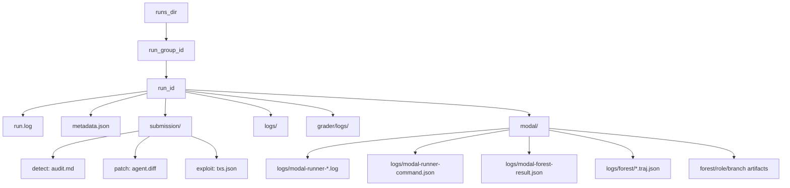

Watch out for Modal retry artifact overwrites. If each retry reuses the same
`run_dir/modal` output path, the latest attempt can overwrite
`modal-forest-result.json` and copied forest artifacts from earlier attempts.
The command stdout/stderr logs and Modal app logs may be the only complete
timeline.

## Practical Debug Checklist

For local container runs:

1. Check `run.log` first.
2. Check `/home/agent/submission` extraction in the run dir.
3. For model/network failures, check whether the gateway sidecar allowlisted the
   model host.
4. For exploit mode, inspect `logs/veto.log`, `logs/txs.log`,
   `logs/exec_txs.log`, and `submission/txs.json`.

For Modal forest runs:

1. Start with direct `entrypoint.py forest`, not Phase 6, when debugging infra.
2. Use one role, one branch, low step limits, and no
   `--continue-on-worker-error`.
3. Set `runner.max_retries=0` when using nanoeval or Phase 6.
4. Count expected sandboxes before running:

```text
1 + roles * branches_per_tree + roles + 1
```

5. Preserve raw logs immediately:

```text
_phase6_command_logs/
modal/logs/modal-runner-*.log
modal/logs/modal-forest-result.json
modal/logs/forest/*.traj.json
Modal app logs by app id
```

## Recommended Commands

Direct single-attempt Modal forest debug:

```bash
set -a
. ./.env
set +a

export UV_CACHE_DIR=/tmp/uv-cache
export MODEL="${VLLM_LITELLM_MODEL:-openai/${VLLM_SERVED_MODEL_NAME}}"
export MODEL_KWARGS_JSON="${MODEL_KWARGS_JSON:-{\"drop_params\":true}}"
export MSWEA_COST_TRACKING="${MSWEA_COST_TRACKING:-ignore_errors}"
export OUTPUT_DIR="runs/modal-forest-debug/qwen-1role-canto-$(date -u +%Y%m%dT%H%M%SZ)"

uv run python evmbench/agents/mini-swe-agent/entrypoint.py forest \
  --audit-id 2024-01-canto \
  --mode detect \
  --hint-level none \
  --image "${MODAL_AUDIT_IMAGE_REPO:-ghcr.io/pranay5255/evmbench-audit}:2024-01-canto" \
  --model "$MODEL" \
  --model-kwargs-json "$MODEL_KWARGS_JSON" \
  --cost-tracking "$MSWEA_COST_TRACKING" \
  --scout-step-limit 4 \
  --branch-step-limit 6 \
  --judge-step-limit 4 \
  --global-step-limit 4 \
  --scout-cost-limit 0.5 \
  --branch-cost-limit 0.5 \
  --judge-cost-limit 0.5 \
  --global-cost-limit 0.5 \
  --branches-per-tree 1 \
  --max-tree-roles 1 \
  --tree-roles token-flow \
  --worker-concurrency 1 \
  --output-dir "$OUTPUT_DIR"
```

Direct nanoeval no-retry command:

```bash
set -a
. ./.env
set +a

export UV_CACHE_DIR=/tmp/uv-cache
export RUNS_DIR="runs/nano/manual-no-retry-$(date -u +%Y%m%dT%H%M%SZ)"

uv run python -m evmbench.nano.entrypoint \
  evmbench.audit=2024-01-canto \
  evmbench.mode=detect \
  evmbench.audit_split=detect-tasks \
  evmbench.hint_level=none \
  evmbench.log_to_run_dir=True \
  evmbench.runs_dir="$RUNS_DIR" \
  evmbench.solver=evmbench.nano.solver.EVMbenchSolver \
  evmbench.solver.agent_id=mini-swe-agent-modal-forest-qwen-vllm-2trees-debug \
  runner.concurrency=1 \
  runner.max_retries=0
```

## Key Takeaways

- `nanoeval` retries whole tasks, not individual failed model calls.
- EVMBench Modal forest tasks can be expensive because one logical attempt
  expands into multiple Modal sandboxes.
- Local container runs have a main agent container, an optional exploit chain
  sidecar, and an optional model gateway sidecar.
- Exploit mode is intentionally two-phase: the agent creates on-chain behavior,
  then the grader replays extracted transactions in a fresh grading computer.
- For dataset generation, raw artifact preservation and retry isolation are as
  important as model quality. Without per-attempt artifacts, failed retries can
  overwrite the evidence needed for RCA and training data extraction.
