# Nanoeval, EVMBench Nano, Exploit Mode, and Containers

This guide explains the execution system behind EVMBench nano runs: how
`nanoeval` schedules work, how `evmbench.nano` turns audits into tasks, how
local Docker/Alcatraz and Modal runners differ, and how exploit-mode chains,
`ploit`, and `veto` fit into the container topology.

## Mental Model

There are three layers:

1. `nanoeval` is the control plane. It owns task scheduling, concurrency,
   persistence, retries, progress, recorder integration, and summaries.
2. `evmbench.nano` is the benchmark adapter. It creates `EVMTask` objects,
   prepares audit containers, runs the selected agent, extracts outputs, and
   grades detect, patch, or exploit results.
3. Agent/runtime code executes the work. It is either a local container agent
   inside an Alcatraz Docker cluster or a Modal runner that creates remote
   Modal sandboxes.

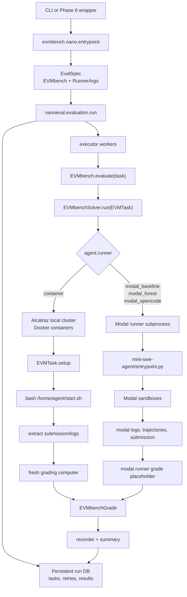

## Source Map

| Area | Main files | What they do |
| --- | --- | --- |
| Nano entrypoint | `evmbench/nano/entrypoint.py` | Builds `EvalSpec(eval=EVMbench, runner=RunnerArgs)` and calls `nanoeval.evaluation.run`. |
| EVMBench eval | `evmbench/nano/eval.py` | Builds audit tasks, run dirs, prompts, run group ids, and final summaries. |
| Solver | `evmbench/nano/solver.py` | Chooses local container vs Modal runner, prepares agents, runs agents, wraps system errors. |
| Task setup/grading | `evmbench/nano/task.py` | Sets up audit containers, exploit chain/veto state, extracts outputs, invokes graders. |
| Local runtime config | `evmbench/nano/runtime.py` | Builds Alcatraz `LocalConfig` for Docker-backed runs. |
| Network gateway | `evmbench/nano/gateway.py` | Creates HAProxy SNI allowlist sidecar and rewires local Docker networking. |
| Graders | `evmbench/nano/grade/*.py` | Detect uses an LLM judge, patch uses tests, exploit replays txs with `ploit`. |
| Agent registry | `evmbench/agents/agent.py` | Loads agent configs, runner type, env vars, start script, gateway allowlist. |
| Modal adapter | `evmbench/agents/modal_runner.py` | Converts agent config into a Modal runner subprocess command. |
| Modal forest | `evmbench/agents/mini-swe-agent/modal_forest.py` | Creates scout, branch, tree judge, and global judge Modal workers. |
| Exploit config | `evmbench/ploit/config.py` | Builds `ploit setup`, `ploit txs`, and `ploit exec-txs` commands. |
| Veto | `evmbench/ploit/veto.py` | Starts/stops JSON-RPC filtering proxy inside exploit containers. |

## Nanoeval Control Plane

`nanoeval` persists all work in a run database. Executor workers pull tasks from
that database, run `spec.eval.evaluate(task)`, save results, and let the driver
decide whether to summarize, retry, or finish.

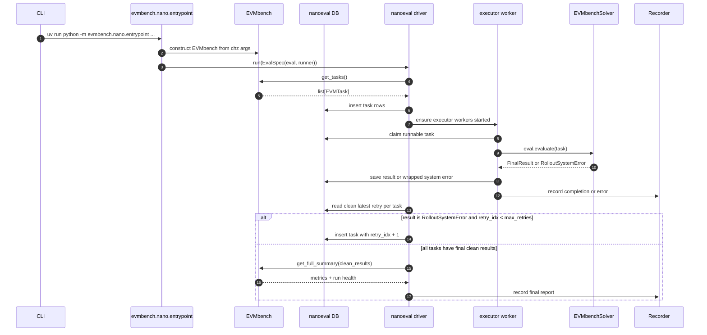

Important retry behavior:

- `RunnerArgs.max_retries` defaults to `16`.
- Only `RolloutSystemError` is retried.
- Other unhandled exceptions crash the eval.
- Clean results are deduped by `(question_id, attempt_id)` and use the largest
  `retry_idx`.
- `runner.concurrency` limits how many tasks run in parallel, but it does not
  limit retries.

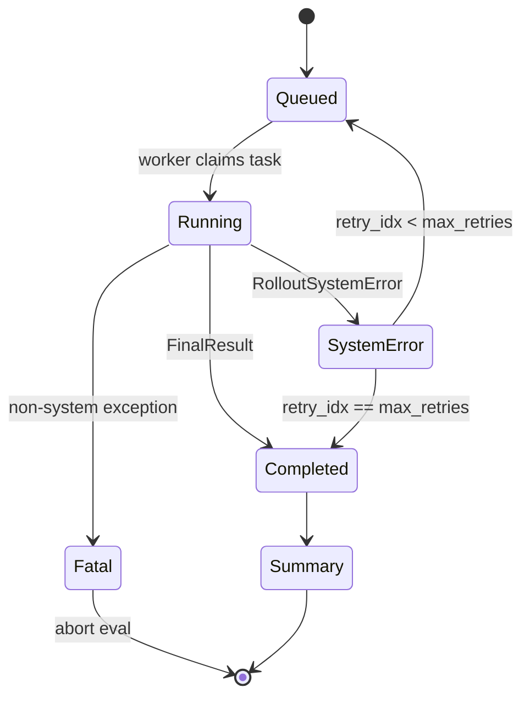

## EVMBench Nano Objects

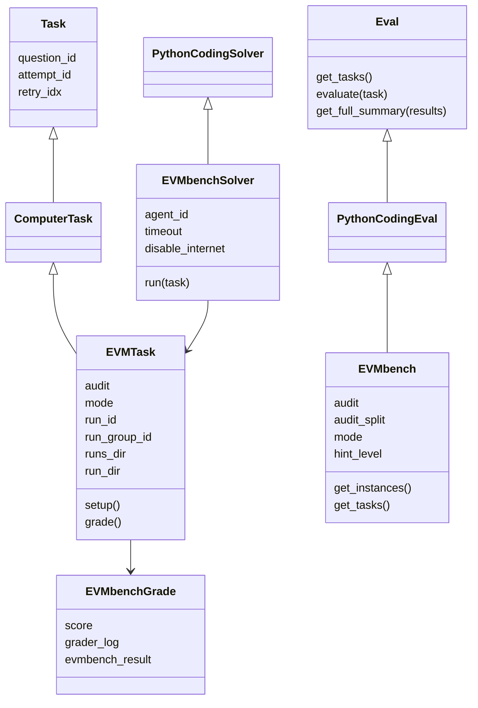

## End-To-End Local Container Run

This is the classic local/Docker path used when `agent.runner == "container"`.

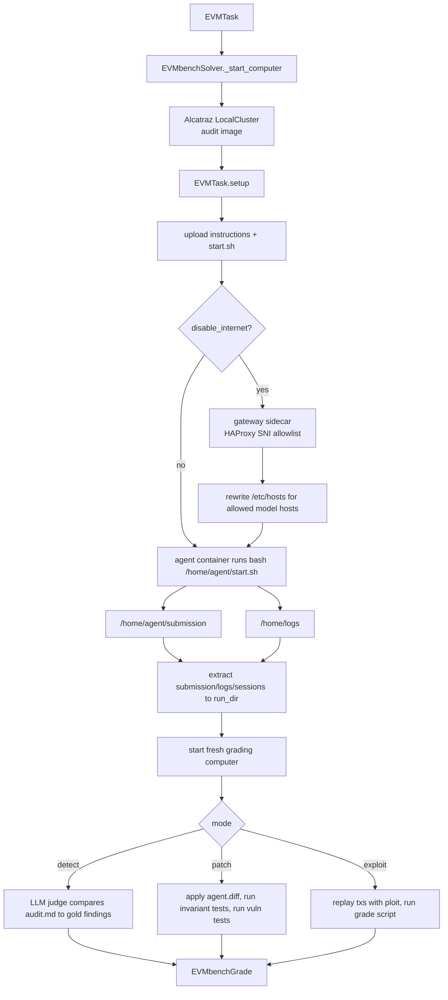

## Local Container Topology

The main container is always container id `0`. In exploit mode with veto enabled,
the solver adds the audit image as a sidecar too, giving a second container for
chain setup and RPC filtering.

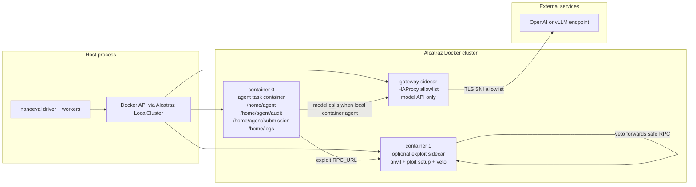

## Alcatraz Computer Interface Contract

Alcatraz is not important because EVMBench needs Docker specifically. It is
important because it gives `nanoeval` a small, stable "computer" interface that
the rest of `evmbench.nano` can treat as a remote machine.

At the `nanoeval` boundary, EVMBench mostly needs:

```text
computer.send_shell_command(cmd)
computer.check_shell_command(cmd)
computer.upload(bytes, remote_path)
computer.download(remote_path)
computer.fetch_container_names()
```

EVMBench adds a thin helper layer in `evmbench/alcatraz.py` for operations that
must target a specific container:

```text
send_shell_command_in_container(computer, cmd, container_id=0)
check_shell_command_in_container(computer, cmd, container_id=1)
upload_to_container(computer, bytes, path, container_id=1)
download_from_container(computer, path, container_id=1)
```

The normal `ComputerInterface` methods always target container `0`, the main
agent container. Container-specific helpers only reach through to Alcatraz
cluster internals when `container_id != 0`. That distinction is the key design
constraint for any Modal replacement: the public object can look like one
computer, but the adapter must still know how to route sidecar operations.

For local detect and patch tasks, one task computer is enough:

1. Start the audit image.
2. Run `EVMTask.setup()`.
3. Upload instructions and `start.sh`.
4. Run the agent.
5. Extract `/home/agent/submission`, `/home/logs`, and optional sessions.
6. Start a fresh grading computer from the same image.
7. Run mode-specific grading.

For local exploit tasks with sidecar enabled, the rollout computer is a small
cluster:

- container `0`: agent workspace and final submission extraction;
- container `1`: Anvil, `ploit setup`, Veto, transaction extraction;
- optional gateway sidecar: model API egress allowlist for local container
  agents.

The exploit sidecar is a security boundary as well as a process layout. Anvil
binds inside the chain container, Veto binds to `0.0.0.0` on the sidecar, and
the agent receives an RPC URL pointing at the sidecar's Veto port. Hidden files
such as `deploy.sh`, `utils.sh`, `.ploit.toml`, and Veto config are removed
before the agent starts. After the agent finishes, the saved `.ploit.toml` is
restored only long enough to run `ploit txs`, and the resulting `txs.json` is
copied back into container `0`.

The clean abstraction to preserve is therefore not "Docker cluster"; it is:

```text
TaskComputer
  - main execution target for agent-visible shell/filesystem work
  - optional named side targets for chain, gateway, or future services
  - deterministic upload/download semantics
  - explicit lifecycle cleanup
  - enough identity metadata to debug a failed run
```

## Agent Runner Branches

The same `EVMbenchSolver.run` method handles local and Modal agents, but the
paths are very different.

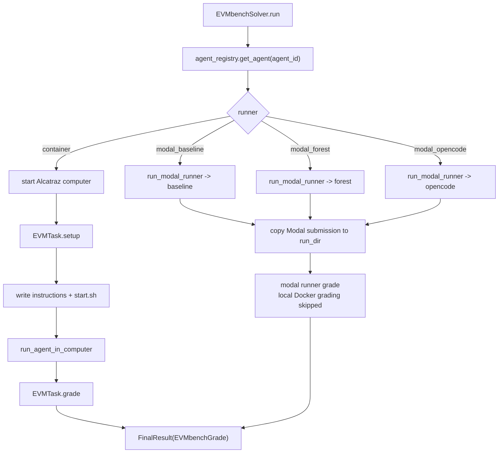

## Detect, Patch, and Exploit Modes

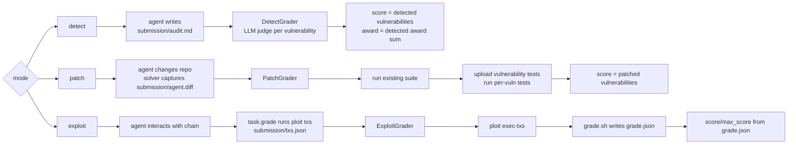

## Exploit Mode Detailed Flow

Exploit mode has two phases: the agent phase and the grading replay phase.

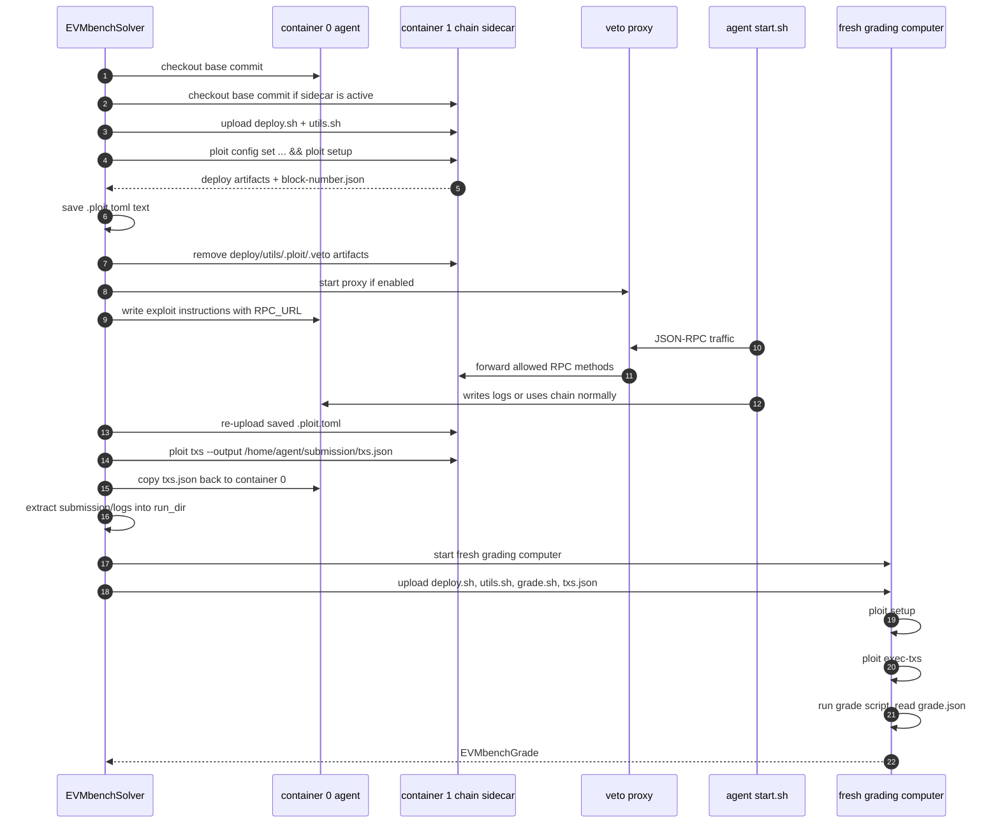

The point of `veto` is to prevent cheap RPC cheating against the local dev
chain. By default it blocks methods such as `eth_sendTransaction`, account
enumeration/signing methods, and direct state mutation helpers like
`hardhat_setStorageAt` and `evm_setAccountBalance`.

## Modal Forest Topology

Modal forest is not one sandbox. It is a set of independent worker sandboxes.
Each worker gets an audit image, SWE-ReX runtime access, role instructions, and
model credentials. The forest coordinator copies back artifacts and trajectories.

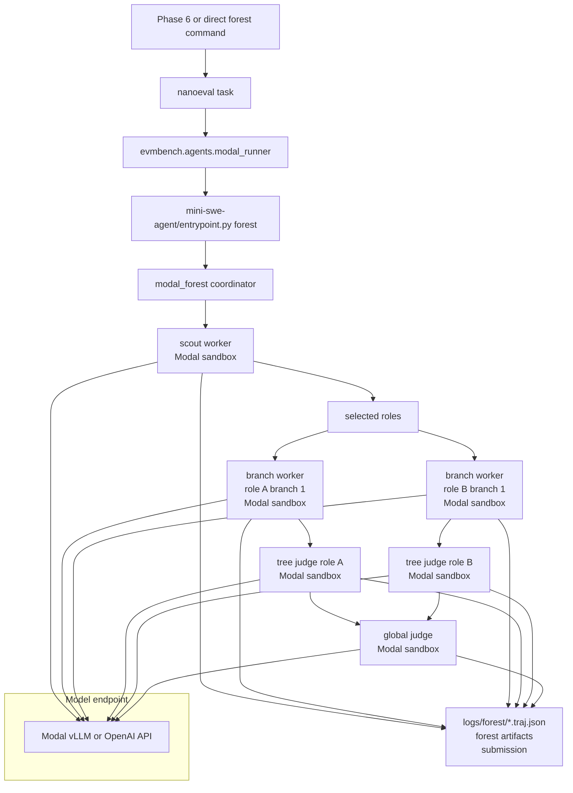

## Recommended Modal Sandbox Scaling Strategy

The current Modal path proves that audit images can run remotely, but it is not
yet a full replacement for the nano/Alcatraz path. `EVMbenchSolver.run()` skips
local Docker entirely for `modal_baseline`, `modal_forest`, and
`modal_opencode`; `evmbench/agents/modal_runner.py` shells out to
`mini-swe-agent/entrypoint.py`; the Modal runner creates SWE-ReX Modal
environments; and the solver records a placeholder grade after a submission is
copied back. That is useful for agent-scale experimentation, but it duplicates
parts of `EVMTask.setup()` and `EVMTask.grade()` and currently bypasses local
Docker grading.

The recommended scaling direction is to make Modal Sandboxes implement the same
computer contract that Alcatraz implements, then keep `evmbench.nano` as the
source of truth for task setup, exploit harness behavior, extraction, and
grading.

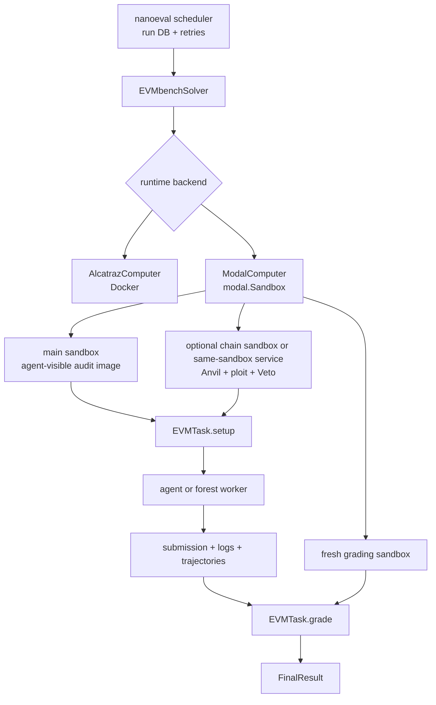

The target architecture has four pieces.

1. Add a `ModalComputerInterface` and `ModalCluster` adapter.

   The adapter should wrap one or more `modal.Sandbox` objects and expose the
   methods used by `ComputerInterface` plus the container-specific methods used
   by `evmbench/alcatraz.py`. `send_shell_command()` maps to
   `Sandbox.exec()`, `upload()` and `download()` map to the Modal filesystem
   APIs, and `fetch_container_names()` returns stable logical names such as
   `["agent", "chain"]`. Store the Modal `object_id`, sandbox name, tags,
   audit id, run id, retry index, worker name, image, and timeout in run
   metadata.

   Modal-specific defaults should be explicit:

   ```text
   app = modal.App.lookup("evmbench-sandboxes", create_if_missing=True)
   sandbox timeout = task timeout plus cleanup margin
   idle_timeout = short enough to clean abandoned workers
   image = modal.Image.from_registry(remote_audit_image)
   secrets = only when the sandbox itself needs them
   tags = audit_id, mode, run_group_id, run_id, retry_idx, worker_type
   ```

   Modal Sandboxes default to a 5 minute lifetime unless a timeout is supplied,
   and can run up to 24 hours. Always set the timeout; otherwise long audits can
   fail for infrastructure reasons that look like agent failures.

   Modal docs backing these assumptions: [Sandboxes](https://modal.com/docs/guide/sandboxes),
   [running commands](https://modal.com/docs/guide/sandbox-spawn),
   [filesystem access](https://modal.com/docs/guide/sandbox-files),
   [networking and security](https://modal.com/docs/guide/sandbox-networking),
   [snapshots](https://modal.com/docs/guide/sandbox-snapshots),
   [job processing](https://modal.com/docs/guide/job-queue), and
   [Docker in Sandboxes](https://modal.com/docs/guide/docker-in-sandboxes).

2. Keep model calls outside the sandbox where possible.

   The current mini-swe-agent design has the Python agent loop and LiteLLM model
   calls in the host process while shell actions execute inside the Modal
   sandbox. Preserve that for detect, patch, and forest workers. It means most
   sandboxes do not need `OPENAI_API_KEY`, `VLLM_API_KEY`, or direct model
   egress at all. The sandbox only needs the audit image, shell tools, and any
   benchmark-local services such as Anvil and Veto.

   For OpenCode-style agents that run the agent process inside the sandbox,
   attach model credentials through Modal Secrets and tag those runs separately.
   Do not pass secrets through generic JSON sandbox kwargs.

3. Reuse `EVMTask.setup()` and `EVMTask.grade()` for Modal.

   Detect mode is the easiest first target. The Modal computer only needs to
   stage instructions, run the agent, extract `submission/audit.md`, and let the
   detect grader run with the same judge code as local runs.

   Patch mode is the next target. Use the same setup/reset logic, capture
   `agent.diff` with `audit.get_diff_command()`, then launch a fresh Modal
   grading sandbox and run the existing patch grader there. This removes the
   current split where Modal can produce a patch but nano records only a
   placeholder grade.

   Exploit mode needs an explicit choice:

   - Fast path: run Anvil, `ploit`, Veto, and the agent in one sandbox, matching
     the current `modal_baseline.py` flow. This scales quickly and reuses the
     hidden-file cleanup logic, but it is weaker than local sidecar isolation
     because the raw Anvil port exists in the same sandbox.
   - Parity path: model the rollout computer as two logical targets, `agent`
     and `chain`. Expose only Veto from the chain target to the agent target,
     keep raw Anvil local to the chain target, and implement
     `send_shell_command_in_container(..., container_id=1)` against the chain
     sandbox. Use this when exploit anti-cheat parity matters.
   - Compatibility fallback: run Docker inside a Modal sandbox and keep the
     existing Alcatraz topology inside that sandbox. Modal marks Docker in
     Sandboxes as alpha and Docker state is not captured by filesystem
     snapshots, so this should be a migration aid rather than the default
     scale architecture.

4. Make Modal the execution fleet, not a second benchmark framework.

   Keep `nanoeval` responsible for task identity, retry policy, result
   persistence, and summaries. Use Modal for the expensive per-task and
   per-worker computers. If the local nanoeval process submits work to Modal
   functions, use `Function.spawn()` for task jobs and record the function call
   id next to the run id. If nanoeval itself runs inside Modal, move the run
   database and artifacts to durable storage such as a Modal Volume or external
   object store.

   Concurrency must be budgeted at all three layers:

   ```text
   live_sandboxes ~= runner.concurrency
                  * attempts_in_flight_per_task
                  * sandboxes_per_attempt
   ```

   For forest:

   ```text
   sandboxes_per_attempt = 1 scout
                         + roles * branches_per_tree
                         + roles tree_judges
                         + 1 global_judge
                         + optional grading sandboxes
   ```

   During infrastructure debugging, set `runner.max_retries=0` and keep
   `FOREST_WORKER_CONCURRENCY` small. At scale, put hard caps in the Modal
   function or controller layer (`max_containers`, explicit worker pools, or a
   queue) so a retry storm cannot multiply into thousands of sandboxes.

### Implementation Phases

Use this sequence to avoid mixing agent quality questions with infrastructure
questions:

1. Build `ModalComputerInterface` for a single sandbox and run one detect task
   through `EVMTask.setup()` and `EVMTask.grade()` with `runner.max_retries=0`.
2. Add patch mode and verify that a fresh Modal grading sandbox produces the
   same score as local Docker for a known gold patch and a known bad patch.
3. Add exploit single-sandbox mode, then decide whether the sidecar parity path
   is required before large exploit sweeps.
4. Refactor `modal_baseline`, `modal_opencode`, and `modal_forest` to request a
   `TaskComputer` from the same factory instead of constructing SWE-ReX
   environments directly.
5. Add artifact durability: per-attempt output directories, Modal sandbox ids,
   Modal function call ids, trajectory manifests, stdout/stderr tails, and
   metadata JSON are written before any retry can overwrite them.
6. Add warm-start optimization only after correctness is stable. Filesystem
   snapshots can reduce startup latency and preserve prepared filesystem state;
   directory snapshots are useful for reusable dependency trees; memory
   snapshots are alpha and should not be required for benchmark correctness.

### Modal Sandbox Operational Notes

- Use registry-pullable audit images. Modal workers cannot rely on local
  `evmbench/audit:<audit_id>` tags.
- Prefer direct Modal Sandbox filesystem APIs for upload/download. Use tar
  archives only for bulk directory transfer or compatibility with existing
  SWE-ReX helpers.
- Set `block_network=True` for sandboxes that do not need outbound network. If
  the sandbox must reach a service, prefer a narrow `cidr_allowlist` or route
  the call through the host/controller. This is easier when model calls stay out
  of the sandbox.
- Use named sandboxes only for singleton resources. Normal task sandboxes should
  use unique names derived from `run_id`, `retry_idx`, and worker role.
- Call `terminate()` or `stop()` in cleanup paths and detach client-side
  handles after use. Abandoned sandboxes should also die via `idle_timeout`.
- Store artifacts in a durable place. Modal Volumes are appropriate when many
  sandboxes need the same data or when results must survive the host process;
  call `sync` for intermediate results in long-running v2 volume workflows.
- Put every retry in a distinct `attempt_<retry_idx>/modal/` directory. The
  current shared `run_dir/modal` convention is convenient for smoke runs but can
  overwrite the evidence needed for debugging and training data extraction.

Formula for Modal forest worker count per full attempt:

```text
workers_per_attempt = 1 scout
                    + (roles * branches_per_tree)
                    + roles tree_judges
                    + 1 global_judge
```

For a 2-role, 1-branch run:

```text
1 + (2 * 1) + 2 + 1 = 6 Modal sandboxes per full attempt
```

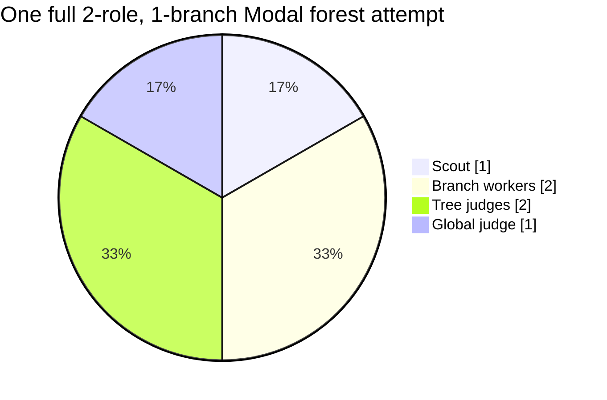

## Retry And Sandbox Growth

Retries multiply whole attempts. They are not just extra model calls.

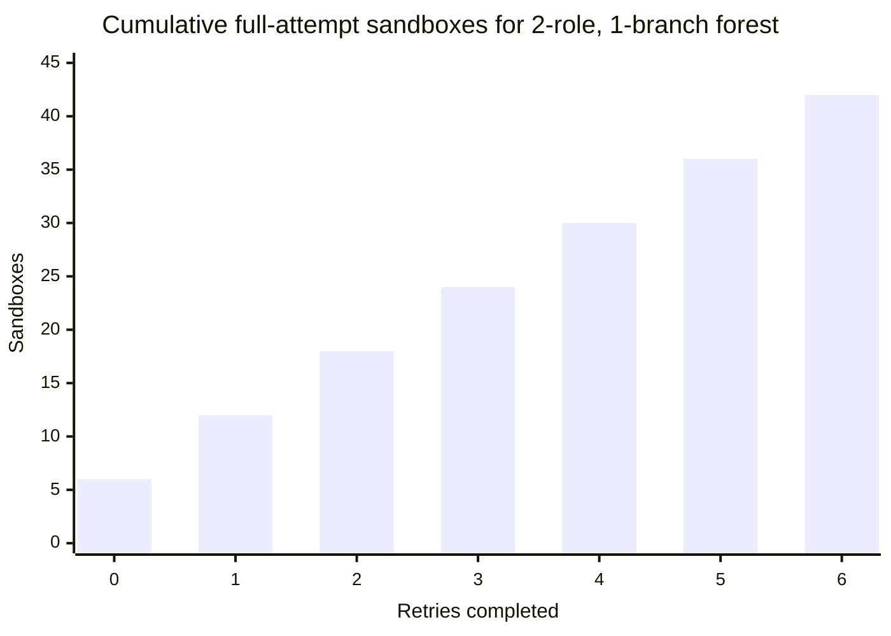

Interpretation:

- `0` retries completed means the first attempt ran once: 6 sandboxes.
- `5` retries completed means 6 full attempts: 36 sandboxes.
- A partial seventh attempt can add 1 or more extra sandboxes.
- With `runner.max_retries=16`, one failed task can run up to 17 attempts.

Use `runner.max_retries=0` for infrastructure debugging unless you explicitly
want retry data.

## Artifact Layout

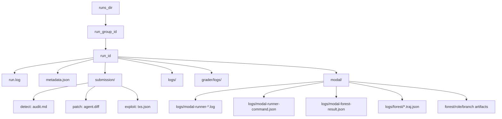

Watch out for Modal retry artifact overwrites. If each retry reuses the same
`run_dir/modal` output path, the latest attempt can overwrite
`modal-forest-result.json` and copied forest artifacts from earlier attempts.
The command stdout/stderr logs and Modal app logs may be the only complete
timeline.

## Practical Debug Checklist

For local container runs:

1. Check `run.log` first.
2. Check `/home/agent/submission` extraction in the run dir.
3. For model/network failures, check whether the gateway sidecar allowlisted the
   model host.
4. For exploit mode, inspect `logs/veto.log`, `logs/txs.log`,
   `logs/exec_txs.log`, and `submission/txs.json`.

For Modal forest runs:

1. Start with direct `entrypoint.py forest`, not Phase 6, when debugging infra.
2. Use one role, one branch, low step limits, and no
   `--continue-on-worker-error`.
3. Set `runner.max_retries=0` when using nanoeval or Phase 6.
4. Count expected sandboxes before running:

```text
1 + roles * branches_per_tree + roles + 1
```

5. Preserve raw logs immediately:

```text
_phase6_command_logs/
modal/logs/modal-runner-*.log
modal/logs/modal-forest-result.json
modal/logs/forest/*.traj.json
Modal app logs by app id
```

## Recommended Commands

Direct single-attempt Modal forest debug:

```bash
set -a
. ./.env
set +a

export UV_CACHE_DIR=/tmp/uv-cache
export MODEL="${VLLM_LITELLM_MODEL:-openai/${VLLM_SERVED_MODEL_NAME}}"
export MODEL_KWARGS_JSON="${MODEL_KWARGS_JSON:-{\"drop_params\":true}}"
export MSWEA_COST_TRACKING="${MSWEA_COST_TRACKING:-ignore_errors}"
export OUTPUT_DIR="runs/modal-forest-debug/qwen-1role-canto-$(date -u +%Y%m%dT%H%M%SZ)"

uv run python evmbench/agents/mini-swe-agent/entrypoint.py forest \
  --audit-id 2024-01-canto \
  --mode detect \
  --hint-level none \
  --image "${MODAL_AUDIT_IMAGE_REPO:-ghcr.io/pranay5255/evmbench-audit}:2024-01-canto" \
  --model "$MODEL" \
  --model-kwargs-json "$MODEL_KWARGS_JSON" \
  --cost-tracking "$MSWEA_COST_TRACKING" \
  --scout-step-limit 4 \
  --branch-step-limit 6 \
  --judge-step-limit 4 \
  --global-step-limit 4 \
  --scout-cost-limit 0.5 \
  --branch-cost-limit 0.5 \
  --judge-cost-limit 0.5 \
  --global-cost-limit 0.5 \
  --branches-per-tree 1 \
  --max-tree-roles 1 \
  --tree-roles token-flow \
  --worker-concurrency 1 \
  --output-dir "$OUTPUT_DIR"
```

Direct nanoeval no-retry command:

```bash
set -a
. ./.env
set +a

export UV_CACHE_DIR=/tmp/uv-cache
export RUNS_DIR="runs/nano/manual-no-retry-$(date -u +%Y%m%dT%H%M%SZ)"

uv run python -m evmbench.nano.entrypoint \
  evmbench.audit=2024-01-canto \
  evmbench.mode=detect \
  evmbench.audit_split=detect-tasks \
  evmbench.hint_level=none \
  evmbench.log_to_run_dir=True \
  evmbench.runs_dir="$RUNS_DIR" \
  evmbench.solver=evmbench.nano.solver.EVMbenchSolver \
  evmbench.solver.agent_id=mini-swe-agent-modal-forest-qwen-vllm-2trees-debug \
  runner.concurrency=1 \
  runner.max_retries=0
```

## Key Takeaways

- `nanoeval` retries whole tasks, not individual failed model calls.
- EVMBench Modal forest tasks can be expensive because one logical attempt
  expands into multiple Modal sandboxes.
- Local container runs have a main agent container, an optional exploit chain
  sidecar, and an optional model gateway sidecar.
- Exploit mode is intentionally two-phase: the agent creates on-chain behavior,
  then the grader replays extracted transactions in a fresh grading computer.
- For dataset generation, raw artifact preservation and retry isolation are as
  important as model quality. Without per-attempt artifacts, failed retries can
  overwrite the evidence needed for RCA and training data extraction.
