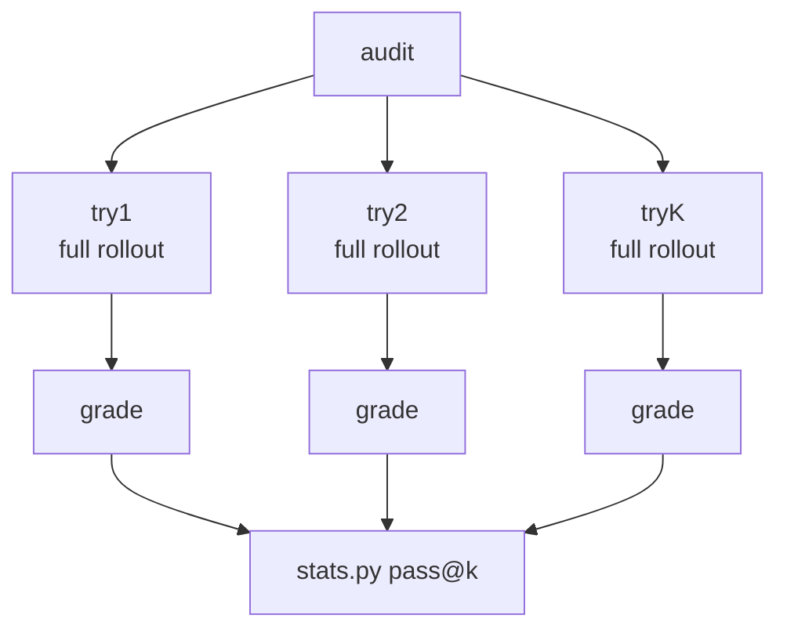
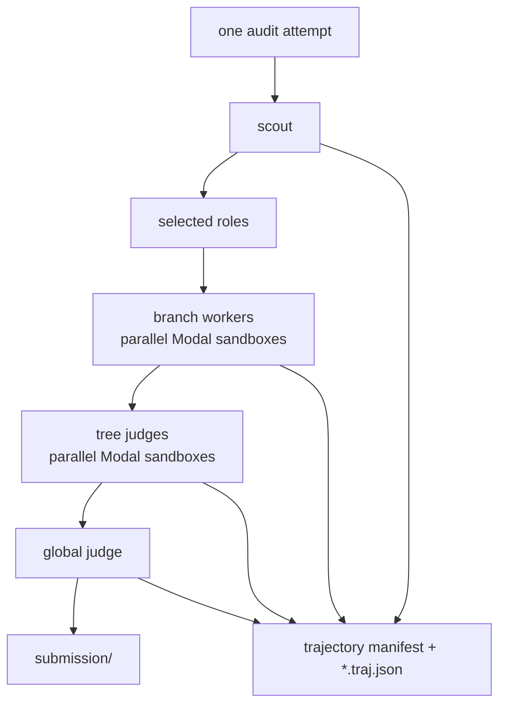
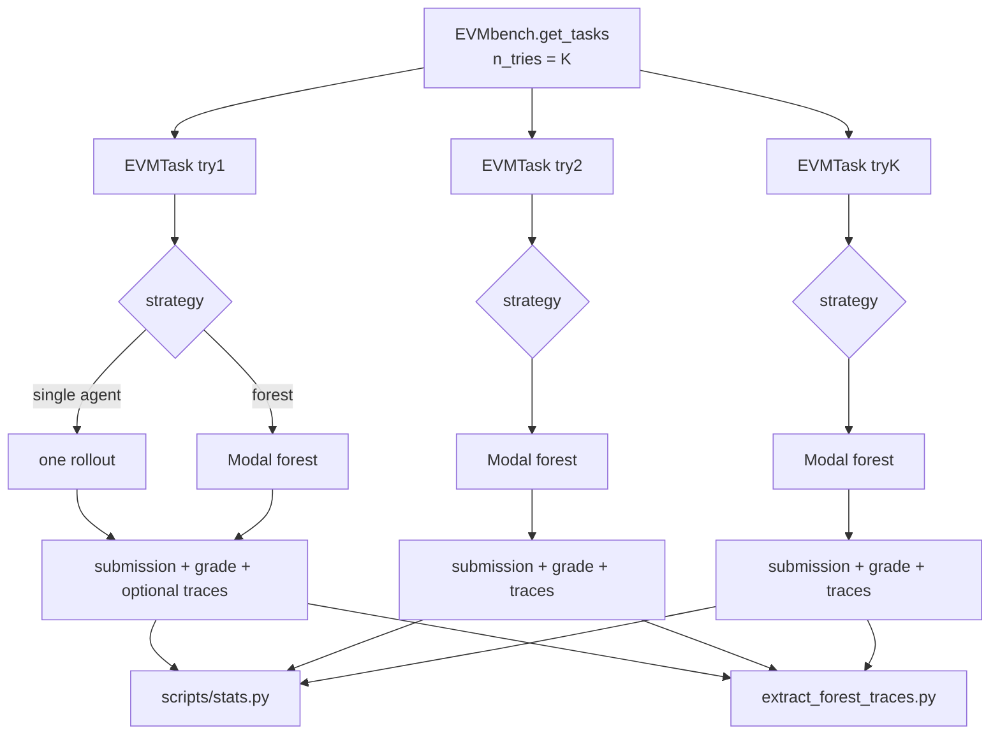
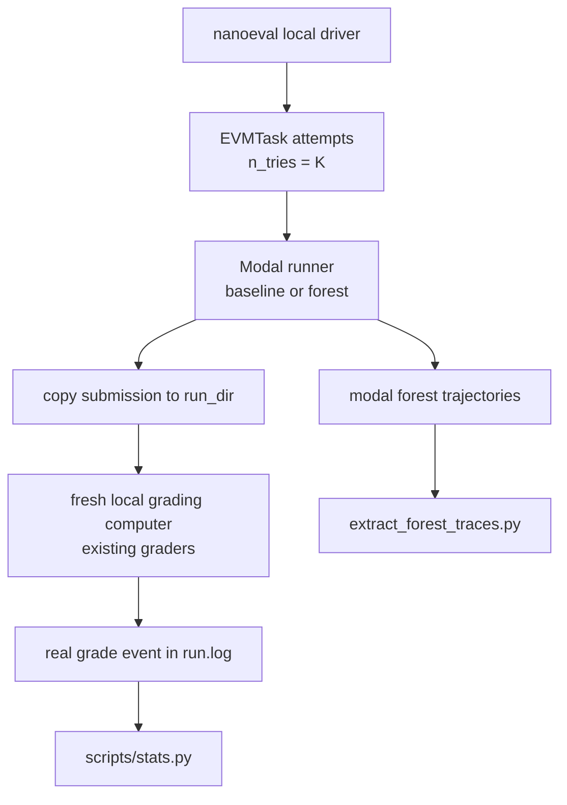
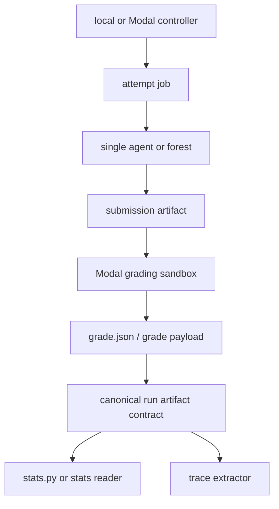

# Test-Time Scaling Combination Architecture

This note explains how the two current EVMBench test-time scaling systems fit
together and how to unify them for Modal deployment.

The short version:

- `n_tries` / `pass@k` is the outer attempt layer.
- Modal forest is the inner per-attempt strategy.
- The clean unification is not a new solver that loops internally. It is a
  shared per-attempt artifact and grading contract that every strategy writes.
- Modal forest can already be selected as an agent under nanoeval, but the
  Modal runner path currently records a placeholder grade unless local grading
  is reintroduced or Modal-native grading is added.

## Current Systems

### System A: Nano `n_tries` And `pass@k`

Files:

- `evmbench/nano/eval.py`
- `evmbench/nano/solver.py`
- `evmbench/nano/task.py`
- `scripts/stats.py`

`EVMbench.get_tasks()` clones each `EVMTask` when `evmbench.n_tries > 1`.
Each clone gets a distinct run id and run directory:

```text
<audit_id>_<uuid>-try1/
<audit_id>_<uuid>-try2/
...
<audit_id>_<uuid>-tryK/
```

Each try is a full independent rollout and should produce:

```text
run.log
metadata.json
submission/audit.md | submission/agent.diff | submission/txs.json
grader/logs/
```

`scripts/stats.py` then parses `run.log`, extracts per-vulnerability
`vulnerability_results`, groups by `(audit_id, vulnerability_id, try_index)`,
and computes `best@k`, `oracle_best@k`, and `pass@k`.

This is the standard independent-resampling strategy:



### System B: Modal Forest

Files:

- `evmbench/agents/modal_runner.py`
- `evmbench/agents/mini-swe-agent/modal_forest.py`
- `evmbench/agents/mini-swe-agent/scout.py`
- `evmbench/agents/mini-swe-agent/judge.py`
- `evmbench/agents/mini-swe-agent/config.yaml`

Modal forest is one strategy for one attempt. It expands a single audit attempt
into multiple Modal sandbox workers:

```text
1 scout
+ role/file scoped branch workers
+ one tree judge per role
+ one global judge
```

The coordinator writes:

```text
modal/submission/<artifact>
modal/logs/modal-forest-result.json
modal/logs/forest/trajectory-manifest.json
modal/logs/forest/**/*.traj.json
modal/forest/** branch and judge artifacts
```

The global judge is the only worker allowed to write the final submission.
Branch workers and tree judges write intermediate reports, diffs, or tx lists
under `forest/`.



### System C: Forest Trace Extraction

Files:

- `evmbench/experiments/extract_forest_traces.py`
- `evmbench/experiments/trace_schema.py`

The extractor reads run directories or Phase 6 output roots, discovers forest
metadata under `modal/logs`, and emits validated JSONL rows for decision points
and branch summaries.

This is downstream of the execution contract. It does not decide how attempts
are launched. It only needs complete Modal forest artifacts and enough
provenance to identify the audit, mode, run group, model, and worker.

## Current Integration Boundary

The current code already lets nanoeval select a Modal forest agent:

```bash
uv run python -m evmbench.nano.entrypoint \
  evmbench.audit=2024-01-canto \
  evmbench.mode=detect \
  evmbench.audit_split=detect-tasks \
  evmbench.n_tries=3 \
  evmbench.solver=evmbench.nano.solver.EVMbenchSolver \
  evmbench.solver.agent_id=mini-swe-agent-modal-forest-qwen-vllm-2trees-debug \
  runner.concurrency=1
```

Conceptually, that means:

```text
try1 = full Modal forest
try2 = full Modal forest
try3 = full Modal forest
```

The practical blocker is grading. For `agent.runner != "container"`,
`EVMbenchSolver.run()` calls the Modal runner, copies the submission artifact
back to the nano run directory, and then records a placeholder grade with
`graded_in_modal_runner: False`. That placeholder grade does not contain real
per-vulnerability `vulnerability_results`, so `scripts/stats.py` cannot compute
meaningful pass@k for Modal forest outputs yet.

## Desired Unified Contract

Every attempt should write the same benchmark-facing contract, regardless of
whether the attempt used a local container agent, Modal baseline, Modal forest,
OpenCode, or a future Modal-native runner.

```text
runs_dir/
  run_group_id/
    group.log
    <audit_id>_<uuid>-tryN/
      run.log
      metadata.json
      submission/
        audit.md | agent.diff | txs.json
      grader/
        logs/
      modal/
        logs/
          modal-runner-command.json
          modal-forest-result.json
          forest/trajectory-manifest.json
          forest/**/*.traj.json
        forest/
```

The minimum semantic contract is:

| Field | Required For | Purpose |
| --- | --- | --- |
| `run_id` with `-tryN` | pass@k | Maps one attempt to one seed/try index. |
| `submission/<artifact>` | all modes | Mode-specific candidate output. |
| parseable grade event in `run.log` | stats and Phase 6 | Contains score, max score, and details. |
| `details.vulnerability_results` | pass@k | Per-vulnerability success values. |
| `metadata.json` | runtime summaries | Agent or strategy runtime. |
| `modal/logs/forest/trajectory-manifest.json` | trace extraction | Declares expected and found forest trajectories. |
| `modal/logs/forest/**/*.traj.json` | dataset generation | Raw decision traces. |

The attempt boundary is the unit of statistics. The strategy boundary is an
implementation detail inside the attempt.



## Scaling Strategy Matrix

Use one schema for all test-time scaling experiments:

```text
ScalingPlan
  attempt_count: K
  attempt_strategy: single_agent | forest
  execution_backend: local | modal
  grading_backend: local | modal
  trace_backend: none | mini_swe_agent
  outer_concurrency: runner.concurrency
  inner_concurrency: strategy-specific worker concurrency
```

That gives these concrete experiment families:

| Name | Meaning | Current Status |
| --- | --- | --- |
| `single_agent@K` | Run K independent local/container or Modal baseline attempts. | Local path works when grades are emitted. Modal baseline needs real grading for stats. |
| `forest@1` | Run one forest attempt per audit. | Modal forest produces submissions and traces. Grade path is the weak point. |
| `forest@K` | Run K independent forest attempts per audit. | Task expansion exists via `n_tries`; needs grading and artifact isolation. |
| `shared_forest_global@K` | Run one scout/branch/tree set, then sample K global judges. | Not implemented. Useful cheaper ablation, but semantics differ from full pass@k. |
| `forest_config_sweep` | Vary roles, branches, budgets, models, or worker concurrency. | Partly represented as agent config variants. Needs a canonical run manifest for comparison. |

Do not hide K inside a solver loop. If an agent internally loops over K
attempts, nanoeval sees only one task result and `scripts/stats.py` cannot
group independent tries correctly.

## Compute Budgeting

There are two concurrency layers today:

```text
outer_concurrency = nanoeval runner.concurrency
inner_concurrency = FOREST_WORKER_CONCURRENCY
```

Approximate live worker pressure:

```text
live_modal_workers ~= outer_concurrency * inner_concurrency
```

Approximate total forest worker count per attempt:

```text
workers_per_attempt =
  1 scout
  + branch_workers
  + roles tree_judges
  + 1 global_judge
```

For detect and patch, branch workers can be scoped by files:

```text
branch_workers =
  roles * max(1, len(audit_scope_files)) * branches_per_tree
```

For exploit, the forest currently uses full-workspace scope:

```text
branch_workers =
  roles * branches_per_tree
```

Full forest pass@k cost:

```text
total_workers ~= audits * K * workers_per_attempt
```

Example with 4 roles, one scoped file, and `branches_per_tree=1`:

```text
workers_per_attempt = 1 + 4 + 4 + 1 = 10
forest@5 = 50 Modal workers per audit, plus grading workers
```

Example with 4 roles, 3 scoped files, and `branches_per_tree=1`:

```text
branch_workers = 4 * 3 * 1 = 12
workers_per_attempt = 1 + 12 + 4 + 1 = 18
forest@5 = 90 Modal workers per audit, plus grading workers
```

## Modal Deployment Architecture

There are two viable deployment phases.

### Phase 1: Modal Execution, Local Grading

This is the smallest change that makes pass@k meaningful for Modal forest.



Implementation shape:

1. Keep `EVMbench.get_tasks()` as the attempt expander.
2. Keep `run_modal_runner()` as the Modal execution adapter.
3. After copying `modal/submission/<artifact>` into `run_dir/submission/`,
   invoke the same local grading path used by `EVMTask.grade()`.
4. Ensure `grade.evmbench_result.agent_output` is set to the Modal runtime.
5. Preserve Modal traces under the same attempt run dir.

This makes the existing `scripts/stats.py`, Phase 6 summary, and trace
extractor work with minimal conceptual change.

### Phase 2: Modal Execution, Modal Grading

This moves the expensive grading containers to Modal too.



Implementation shape:

1. Introduce a `TaskComputer` or `ComputerBackend` abstraction for local and
   Modal computers.
2. Make Modal grading invoke the same detect, patch, and exploit grader logic.
3. Write a canonical `grade.json` in addition to the existing `run.log` event.
4. Teach `scripts/stats.py` to prefer `grade.json` when present and fall back
   to parsing `run.log`.
5. Store Modal sandbox ids, function call ids, image tags, retry ids, and
   worker ids in metadata.

Phase 2 is the correct long-term deployment model, but Phase 1 is the fastest
way to unblock forest@K statistics.

## Required Code Changes

### 1. Grade Modal Submissions

Current behavior:

```text
agent.runner != "container"
  -> run Modal subprocess
  -> copy submission
  -> return placeholder grade
```

Target behavior:

```text
agent.runner != "container"
  -> run Modal subprocess
  -> copy submission
  -> run real grader against copied submission
  -> return real EVMbenchGrade
```

The cleanest short-term implementation is a helper such as:

```text
EVMbenchSolver._grade_submission_artifact(task, agent_output)
```

It should:

- compute `run_dir/submission/<artifact>`;
- start a fresh grading computer through `task._start_computer()` or a public
  wrapper;
- build `GraderContext`;
- call `build_grader(task.mode, grading_computer, runtime_config.turn_completer)`;
- attach `agent_output` to the result.

Patch and exploit grading may need mode-specific setup that currently lives in
`EVMTask.grade()`. If direct helper reuse is too invasive, factor
`EVMTask.grade()` so "extract from rollout computer" and "grade existing
artifact" are separate methods.

### 2. Add Phase 6 `--n-tries`

`evaluate_phase6.py` should accept:

```text
--n-tries K
--runner-concurrency N
--max-retries R
```

and pass:

```text
evmbench.n_tries=K
runner.concurrency=N
runner.max_retries=R
```

Keep the default conservative:

```text
n_tries = 1
runner.concurrency = 1
runner.max_retries = 0 for debug ladders
```

### 3. Add Attempt Provenance To Forest Metadata

The forest metadata should include enough identity to join attempts, traces,
grades, and stats:

```json
{
  "audit_id": "2024-01-canto",
  "mode": "detect",
  "run_group_id": "...",
  "run_id": "2024-01-canto_<uuid>-try2",
  "attempt_id": 1,
  "try_index": 2,
  "retry_idx": 0,
  "strategy": "modal_forest",
  "strategy_config_id": "mini-swe-agent-modal-forest-qwen-vllm-2trees-debug"
}
```

Today, some of this can be inferred from path names. It should be explicit.

### 4. Make Artifact Writes Retry-Safe

Nano retry attempts can overwrite `run_dir/modal` because retry identity is not
encoded in that path. Store Modal artifacts under a retry-specific directory
when retries are enabled:

```text
run_dir/
  modal/
    retry0/
    retry1/
```

or disable retries for Modal infrastructure experiments:

```text
runner.max_retries=0
```

For pass@k, the important isolation is `-tryN`. For infrastructure RCA, retry
isolation matters too.

### 5. Add Canonical `grade.json`

`run.log` parsing works, but it is fragile. Add:

```text
run_dir/grade.json
```

with:

```json
{
  "audit_id": "...",
  "mode": "detect",
  "score": 1,
  "max_score": 3,
  "detect_award": 1000.0,
  "detect_max_award": 4000.0,
  "details": {
    "vulnerability_results": []
  }
}
```

Then update `scripts/stats.py` to read `grade.json` first and use `run.log` as
compatibility fallback.

## Comparison Frontiers

Once the artifact contract is unified, the useful experiments are compute
frontiers rather than one-off runner comparisons.

Recommended matrix:

| Frontier | Compare |
| --- | --- |
| Diversity | `single_agent@1,2,4,8` |
| Depth | `forest@1` with 2, 4, 8 roles |
| Hybrid | `forest@2,4` with fixed role count |
| Cheap merger diversity | one branch set plus `global_judge@K` |
| Budget matched | same expected worker count or same wall-clock cap |

Report every row with:

- attempts per audit;
- roles;
- branches per tree;
- audit scope file count;
- worker concurrency;
- total worker count;
- wall-clock runtime;
- model token usage when available;
- pass@k and best@k;
- trajectory integrity.

## Recommended Rollout

1. Make one Modal forest detect run produce a real local grade.
2. Run `evmbench.n_tries=2` for one detect audit and verify two `-tryN` dirs
   each contain a real grade with `vulnerability_results`.
3. Run `scripts/stats.py` on that run group and verify non-placeholder
   `best@k` and `pass@k` rows.
4. Run `extract_forest_traces.py` on the same output and verify both attempts
   contribute trace rows.
5. Add Phase 6 `--n-tries`.
6. Move patch grading to the same path.
7. Decide whether exploit Modal deployment needs sidecar parity before scaling
   exploit forest runs.

## Design Rules

- Keep `n_tries` as the outer attempt expander.
- Keep one run directory per attempt.
- Keep forest as a per-attempt strategy.
- Do not compute pass@k from placeholder grades.
- Do not compare forest and pass@k without reporting worker count and runtime.
- Preserve raw Modal forest trajectories before any summarization step.
- Make retry identity explicit whenever Modal artifacts are written.
